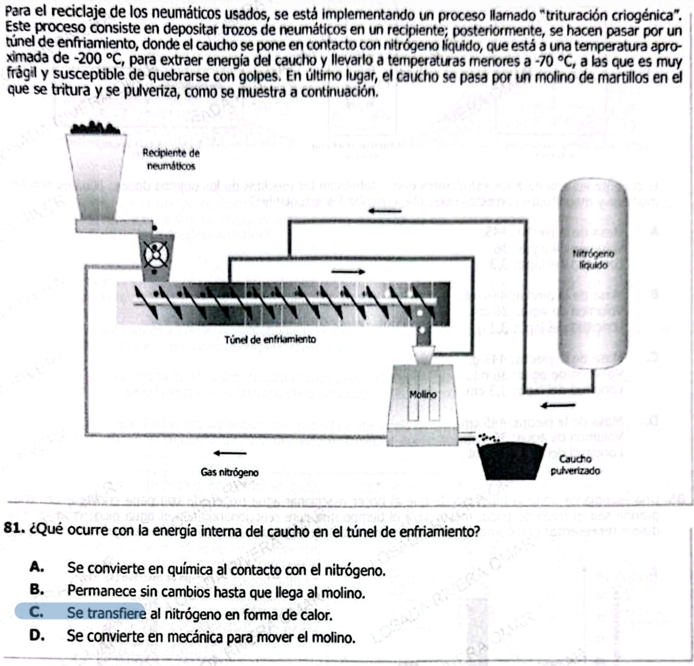

Estos son los **conceptos de termodinámica directamente involucrados** en la trituración criogénica:

### 1. **Energía interna (U)**

* La energía interna del caucho **disminuye** al enfriarse.
* Está asociada al movimiento microscópico de sus moléculas.

### 2. **Transferencia de calor (Q)**

* El calor fluye **del caucho al nitrógeno líquido**.
* Ocurre por diferencia de temperatura (caucho más caliente → nitrógeno mucho más frío).

### 3. **Temperatura**

* Variable clave que determina el estado del material.
* Al bajar de \~−70 °C, el caucho cambia su comportamiento mecánico (se vuelve frágil).

### 4. **Equilibrio térmico**

* El sistema tiende a un balance donde ambos (caucho y nitrógeno) intercambian energía hasta estabilizarse (aunque aquí el proceso es forzado y continuo).

### 5. **Capacidad calorífica / calor específico**

* Determina cuánta energía debe extraerse del caucho para bajar su temperatura.

### 6. **Cambios en propiedades macroscópicas por temperatura**

* No es un cambio de fase clásico, pero sí un cambio de **comportamiento físico** (de elástico a frágil).

### 7. **Primera ley de la termodinámica**

* Variación de energía interna:
  $$
  \Delta U = Q - W
  $$
* Aquí, principalmente:
  * $$Q < 0$$ (el sistema pierde calor)
  * Trabajo mecánico es despreciable en el túnel

***

### Resumen corto (nivel ICFES)

El proceso evalúa:

* **Cómo se transfiere el calor**
* **Qué pasa con la energía interna al enfriar un material**
* **Cómo la temperatura afecta propiedades físicas**

Perfecto — esto es exactamente el tipo de entrenamiento que maximiza transferencia para ICFES.

Voy a darte **5 preguntas conceptuales por cada uno de los 7 conceptos** (35 en total), enfocadas en **razonamiento, no cálculo**.

***

# 1. **Energía interna (U)**

1. ¿Qué le ocurre a la energía interna de un material cuando sus partículas disminuyen su agitación térmica?
2. ¿Puede un sistema disminuir su energía interna sin realizar trabajo mecánico? ¿Cómo?
3. Si dos objetos están a distinta temperatura, ¿cuál tiene mayor energía interna necesariamente? Explica.
4. ¿La energía interna depende del estado del sistema o del proceso que siguió?
5. ¿Qué relación existe entre energía interna y temperatura en materiales sin cambio de fase?

***

# 2. **Transferencia de calor (Q)**

1. ¿En qué dirección fluye el calor cuando dos cuerpos a diferente temperatura entran en contacto?
2. ¿Es posible que un cuerpo frío transfiera calor a uno caliente sin intervención externa?
3. ¿El calor es una propiedad del sistema o un proceso?
4. ¿Qué condición debe existir para que haya transferencia de calor?
5. ¿El equilibrio térmico implica ausencia total de energía o solo ausencia de flujo de calor?

***

# 3. **Temperatura**

1. ¿Qué mide realmente la temperatura a nivel microscópico?
2. ¿Dos sistemas con la misma temperatura tienen necesariamente la misma energía interna?
3. ¿Por qué materiales distintos cambian diferente su temperatura al recibir la misma cantidad de calor?
4. ¿Puede existir transferencia de calor entre cuerpos con igual temperatura?
5. ¿Qué diferencia conceptual hay entre calor y temperatura?

***

# 4. **Equilibrio térmico**

1. ¿Qué condición define que dos sistemas estén en equilibrio térmico?
2. Si A está en equilibrio térmico con B, y B con C, ¿qué se puede afirmar sobre A y C?
3. ¿Puede haber intercambio de energía cuando dos sistemas están en equilibrio térmico?
4. ¿El equilibrio térmico depende del material o solo de la temperatura?
5. ¿Cómo se relaciona el equilibrio térmico con la ley cero de la termodinámica?

***

# 5. **Capacidad calorífica / Calor específico**

1. ¿Qué significa que un material tenga alto calor específico?
2. ¿Dos materiales que reciben la misma cantidad de calor siempre aumentan igual su temperatura?
3. ¿Por qué el agua tarda más en calentarse que el metal?
4. ¿La capacidad calorífica depende de la cantidad de sustancia?
5. ¿Qué implica físicamente extraer calor de un material con alta capacidad calorífica?

***

# 6. **Cambios en propiedades macroscópicas por temperatura**

1. ¿Por qué algunos materiales se vuelven frágiles a bajas temperaturas?
2. ¿Un cambio en propiedades mecánicas implica siempre un cambio de fase?
3. ¿Cómo afecta la temperatura el movimiento molecular en sólidos?
4. ¿Puede un material cambiar su comportamiento sin cambiar su composición química?
5. ¿Qué relación existe entre energía térmica y elasticidad en polímeros?

***

# 7. **Primera ley de la termodinámica (ΔU = Q − W)**

1. ¿Puede la energía interna aumentar si no hay transferencia de calor?
2. ¿Qué ocurre con la energía interna si un sistema pierde calor y no realiza trabajo?
3. ¿El trabajo siempre implica cambio en energía interna?
4. ¿Qué representa físicamente el término W en un sistema térmico?
5. ¿Cómo se conserva la energía en un proceso donde hay calor y trabajo simultáneamente?

***

Perfecto — ahora sí vamos a convertir esto en **material de aprendizaje real**, no solo respuestas.  
Voy a expandir cada respuesta con **intuición + modelo mental + error típico** (clave para ICFES).

***

# 1. **Energía interna (U)**

### 1. ¿Qué le ocurre a la energía interna cuando disminuye la agitación térmica?

✅ **Disminuye**

**Explicación:**  
La energía interna está directamente relacionada con cómo se mueven y vibran las partículas.

* Alta agitación → partículas vibran mucho → alta energía
* Baja agitación → vibran menos → menor energía

**Modelo mental:**  
Imagínate moléculas como pelotas vibrando: si se mueven menos, tienen menos energía.

**Error típico:**  
Creer que “energía interna” es algo abstracto separado del movimiento molecular.

***

### 2. ¿Puede disminuir sin trabajo mecánico?

✅ **Sí, mediante transferencia de calor**

**Explicación:**  
Un sistema puede perder energía simplemente transfiriéndola a otro sistema más frío.  
No necesita hacer trabajo (no necesita empujar, mover, deformar).

**Ejemplo:**  
El caucho en nitrógeno líquido: no hace trabajo, solo pierde calor.

**Error típico:**  
Pensar que toda pérdida de energía implica movimiento o fuerza.

***

### 3. ¿Mayor temperatura = mayor energía interna siempre?

✅ **No necesariamente**

**Explicación:**  
La energía interna depende de:

* temperatura
* cantidad de sustancia
* tipo de material

**Ejemplo:**  
Un vaso de agua caliente vs una piscina tibia → la piscina tiene más energía total.

**Error típico:**  
Confundir “temperatura” con “energía total”.

***

### 4. ¿Depende del proceso o del estado?

✅ **Solo del estado**

**Explicación:**  
No importa cómo llegó el sistema a ese estado.  
Si tiene misma temperatura, presión y cantidad → misma energía interna.

**Error típico:**  
Pensar que “la historia del proceso” cambia la energía interna.

***

### 5. Relación entre energía interna y temperatura

✅ **Directa (sin cambio de fase)**

**Explicación:**  
Al subir la temperatura → aumenta el movimiento molecular → aumenta U.

***

# 2. **Transferencia de calor (Q)**

### 1. Dirección del calor

✅ **Siempre de caliente → frío**

**Explicación:**  
Esto es una ley natural (2ª ley). No es opcional.

**Modelo mental:**  
Como agua que fluye cuesta abajo, el calor fluye hacia menor temperatura.

***

### 2. ¿Frío → caliente espontáneamente?

✅ **No**

**Explicación:**  
Solo ocurre si se suministra energía externa (ej: refrigerador).

**Error típico:**  
Pensar que el frío “entra”. No existe el “flujo de frío”; solo calor que sale.

***

### 3. ¿Calor es propiedad?

✅ **No, es un proceso**

**Explicación:**

* No “tienes calor”
* El calor ocurre cuando hay flujo de energía

**Clave conceptual importante para ICFES.**

***

### 4. Condición para transferencia

✅ **Diferencia de temperatura**

Sin diferencia → no hay flujo.

***

### 5. Equilibrio térmico

✅ **No hay flujo, pero sí energía**

**Explicación:**  
Las moléculas siguen moviéndose, pero el intercambio es balanceado.

***

# 3. **Temperatura**

### 1. ¿Qué mide?

✅ **Energía cinética promedio**

**Explicación:**  
No mide energía total, sino qué tan rápido se mueven las partículas.

***

### 2. Misma temperatura = misma energía interna

✅ **No**

**Ejemplo:**

* 1 kg de hierro
* 1 g de hierro  
  Ambos a 50°C → distinta energía total

***

### 3. Diferentes cambios de temperatura

✅ **Por calor específico**

**Explicación:**  
Materiales diferentes absorben energía de forma diferente.

***

### 4. ¿Calor sin diferencia de temperatura?

✅ **No**

***

### 5. Diferencia entre calor y temperatura

✅

* **Temperatura:** estado
* **Calor:** energía transferida

**Error típico más común del examen.**

***

# 4. **Equilibrio térmico**

### 1. Definición

✅ **Misma temperatura + sin flujo**

***

### 2. Ley cero

✅ **A = C si A = B y B = C**

**Importancia:**  
Permite usar termómetros.

***

### 3. ¿Hay intercambio?

✅ **Sí, pero neto = 0**

***

### 4. ¿Depende del material?

✅ **No**

***

### 5. Relación con ley cero

✅ **La define completamente**

***

# 5. **Capacidad calorífica / Calor específico**

### 1. Alto calor específico

✅ **Difícil de calentar o enfriar**

***

### 2. Igual calor = igual temperatura

✅ **No**

***

### 3. Agua vs metal

✅ **Agua necesita más energía**

***

### 4. Dependencia de masa

✅

* Capacidad calorífica: depende
* Calor específico: no

***

### 5. Extraer calor

✅ **Se necesita mucha energía**

**Aplicación:**  
Por eso enfriar agua es lento.

***

# 6. **Cambios macroscópicos por temperatura**

### 1. Fragilidad a baja temperatura

✅ **Menor movimiento → menor flexibilidad**

***

### 2. Cambio de fase

✅ **No siempre**

***

### 3. Movimiento en sólidos

✅ **Disminuye vibración**

***

### 4. Cambio sin cambiar composición

✅ **Sí**

Ej: el caucho sigue siendo caucho.

***

### 5. Energía y elasticidad

✅ **Más temperatura → más flexibilidad**

***

# 7. **Primera ley (ΔU = Q − W)**

### 1. ΔU sin calor

✅ **Sí (trabajo)**

***

### 2. Pierde calor sin trabajo

✅ **Disminuye U**

***

### 3. Trabajo siempre cambia U

✅ **No necesariamente**

Puede compensarse con calor.

***

### 4. Significado de W

✅ **Energía mecánica transferida**

***

### 5. Conservación de energía

✅ **Todo se transforma**

***

# 🔥 CIERRE (lo que necesitas internalizar)

Si solo te quedas con esto, ya ganas puntos:

* **El calor no es algo que se tiene → es transferencia**
* **La temperatura no es energía total → es promedio**
* **El calor siempre va de caliente a frío**
* **La energía interna baja cuando baja la temperatura**
* **Los materiales responden distinto al calor**
* **Los cambios físicos pueden ocurrir sin cambio químico**
* **La energía nunca se pierde, solo se transforma**

***

Aquí tienes un **resumen visual tipo mapa mental / esquema compacto**, diseñado para que lo puedas **recordar rápido en examen**:

***

# 🧠 **TERMODINÁMICA – MAPA CONCEPTUAL (ICFES)**

```
                 ┌──────────────────────────┐
                 │   TERMODINÁMICA          │
                 └──────────┬───────────────┘
                            │
        ┌───────────────────┼────────────────────┐
        │                   │                    │
   ENERGÍA INTERNA      CALOR (Q)         TEMPERATURA (T)
        │                   │                    │
  - Energía microscópica   - Energía en flujo   - Energía cinética promedio
  - Depende de T, masa     - No es propiedad    - No es energía total
  - Disminuye al enfriar   - Fluye caliente→frío - Determina dirección del calor
```

***

```
        ┌────────────────────────────┐
        │  EQUILIBRIO TÉRMICO        │
        └────────────┬───────────────┘
                     │
        - Misma temperatura
        - No hay flujo de calor
        - Base de la ley cero
```

***

```
   ┌─────────────────────────────┐
   │ CALOR ESPECÍFICO / CAPACIDAD│
   └────────────┬────────────────┘
                │
   - Resistencia al cambio de temperatura
   - Alto → difícil de calentar/enfriar
   - Depende del material
```

***

```
   ┌─────────────────────────────┐
   │ CAMBIOS POR TEMPERATURA     │
   └────────────┬────────────────┘
                │
   - Cambian propiedades físicas
   - Ej: caucho → flexible → frágil
   - No implica cambio químico
```

***

```
      ┌───────────────────────────────┐
      │ PRIMERA LEY (ΔU = Q − W)      │
      └────────────┬──────────────────┘
                   │
   ΔU: cambio de energía interna
   Q: calor (entra o sale)
   W: trabajo (hecho por o sobre el sistema)

   Casos clave:
   - Pierde calor → ΔU ↓
   - Gana calor → ΔU ↑
   - Trabajo sobre sistema → ΔU ↑
```

***

# 🔥 **RELACIÓN CLAVE (TODO CONECTADO)**

```
Temperatura ↓
   ↓
Movimiento molecular ↓
   ↓
Energía interna ↓
   ↓
Material cambia propiedades (ej: fragilidad)
   ↓
Calor se transfirió a otro sistema
```

***

# ⚠️ **ERRORES TÍPICOS (LO QUE EL EXAMEN BUSCA)**

```
❌ “El frío entra” → FALSO → sale calor
❌ Temperatura = energía total → FALSO
❌ El calor es una propiedad → FALSO
❌ Igual temperatura = igual energía → FALSO
❌ Cambios físicos = cambios químicos → FALSO
```

***

# ✅ **FRASE QUE RESUME TODO**

> *La temperatura mide el movimiento de las partículas, el calor es energía que se transfiere por diferencia de temperatura, y esa transferencia cambia la energía interna y las propiedades del material.*

***


# 🧪 **Banco ICFES – Termodinámica (15 preguntas)**

***

### **1.**

Un objeto caliente se coloca en contacto con uno frío. ¿Qué ocurre?

A. El frío pasa al caliente  
B. El calor pasa del caliente al frío  
C. Ambos pierden calor  
D. No hay transferencia

***

### **2.**

La temperatura de un sistema mide:

A. La energía total  
B. El calor almacenado  
C. La energía cinética promedio  
D. La energía potencial

***

### **3.**

Dos cuerpos a la misma temperatura:

A. Tienen igual energía interna  
B. Intercambian calor constantemente  
C. Están en equilibrio térmico  
D. Tienen la misma masa

***

### **4.**

Se enfría un objeto sin hacer trabajo. ¿Qué ocurre con su energía interna?

A. Aumenta  
B. Permanece igual  
C. Disminuye  
D. Se vuelve cero

***

### **5.**

El calor es:

A. Energía almacenada  
B. Energía en tránsito  
C. Temperatura alta  
D. Movimiento molecular

***

### **6.**

Un material con alto calor específico:

A. Se calienta rápido  
B. Se enfría rápido  
C. Requiere mucha energía para cambiar temperatura  
D. Tiene mayor temperatura

***

### **7.**

Si no hay diferencia de temperatura entre dos cuerpos:

A. No hay calor  
B. No hay energía  
C. No hay transferencia de calor  
D. No hay movimiento molecular

***

### **8.**

La energía interna depende de:

A. Solo temperatura  
B. Solo masa  
C. Temperatura, masa y material  
D. Solo volumen

***

### **9.**

Cuando baja la temperatura de un sólido:

A. Aumenta el movimiento molecular  
B. Disminuye la vibración de las partículas  
C. Cambia su composición química  
D. Aumenta su energía interna

***

### **10.**

Un refrigerador funciona porque:

A. El frío se transfiere al interior  
B. El calor desaparece  
C. Se extrae calor usando trabajo  
D. El aire pierde energía espontáneamente

***

### **11.**

¿Qué afirma la primera ley de la termodinámica?

A. El calor siempre fluye  
B. La energía se destruye  
C. La energía se conserva  
D. La temperatura es constante

***

### **12.**

Si un sistema recibe calor y realiza trabajo en igual cantidad:

A. Su energía interna aumenta  
B. Disminuye  
C. No cambia  
D. Se convierte en calor

***

### **13.**

El caucho se vuelve frágil al enfriarse porque:

A. Cambia su composición  
B. Aumenta su energía interna  
C. Disminuye el movimiento molecular  
D. Se vuelve líquido

***

### **14.**

Dos objetos reciben la misma cantidad de calor. Uno cambia más su temperatura porque:

A. Tiene mayor masa  
B. Tiene menor calor específico  
C. Tiene más energía interna  
D. Está más caliente

***

### **15.**

En equilibrio térmico:

A. No hay energía  
B. El calor se detiene completamente  
C. No hay flujo neto de calor  
D. Las partículas dejan de moverse

***

Perfecto — aquí tienes las **15 respuestas con explicación clara + qué idea evalúa cada pregunta** (esto es lo que realmente te entrena).

***

# ✅ **Respuestas explicadas**

***

### **1. → B**

**El calor pasa del caliente al frío**

**Por qué:**  
El calor SIEMPRE fluye espontáneamente desde mayor temperatura a menor temperatura.

**Idea clave:** Dirección del calor  
**Error típico:** creer que "el frío se pasa"

***

### **2. → C**

**Energía cinética promedio**

**Por qué:**  
La temperatura mide qué tan rápido se mueven las partículas, no la energía total.

**Idea clave:** Diferenciar temperatura vs energía total

***

### **3. → C**

**Están en equilibrio térmico**

**Por qué:**  
Misma temperatura = no hay flujo neto de calor.

**Error típico:** pensar que “siguen transfiriendo calor”

***

### **4. → C**

**Disminuye**

**Por qué:**  
Si el sistema se enfría, pierde calor → pierde energía interna.

**Modelo:**  
ΔU = Q − W → si Q < 0 → U disminuye

***

### **5. → B**

**Energía en tránsito**

**Por qué:**  
El calor no “se almacena”, solo ocurre durante transferencia.

**Error típico MUY común:** pensar que el calor es una propiedad interna

***

### **6. → C**

**Requiere mucha energía para cambiar temperatura**

**Por qué:**  
Alto calor específico = difícil de calentar o enfriar.

**Ejemplo:** agua vs metal

***

### **7. → C**

**No hay transferencia de calor**

**Por qué:**  
Sin diferencia de temperatura no hay flujo, aunque sí haya energía interna.

***

### **8. → C**

**Temperatura, masa y material**

**Por qué:**  
La energía interna depende de:

* cuántas partículas hay
* cómo se mueven
* qué tipo de material es

***

### **9. → B**

**Disminuye la vibración**

**Por qué:**  
Menor temperatura → menor movimiento → menor energía interna.

***

### **10. → C**

**Se extrae calor usando trabajo**

**Por qué:**  
El refrigerador usa energía eléctrica para forzar el flujo de calor en contra de lo espontáneo.

**Idea clave:** Segunda ley

***

### **11. → C**

**La energía se conserva**

**Por qué:**  
No se crea ni destruye, solo cambia de forma.

***

### **12. → C**

**No cambia**

**Por qué:**  
ΔU = Q − W  
Si Q = W → ΔU = 0

***

### **13. → C**

**Disminuye el movimiento molecular**

**Por qué:**  
Menos movimiento → menos capacidad de deformarse → se vuelve frágil.

**Conexión real con el problema original.**

***

### **14. → B**

**Menor calor específico**

**Por qué:**  
Menor “resistencia térmica” → cambia más la temperatura.

***

### **15. → C**

**No hay flujo neto de calor**

**Por qué:**  
Las partículas siguen moviéndose, pero no hay intercambio neto.

**Error típico:** pensar que el movimiento se detiene

***

# 🧠 **PATRONES QUE DEBES RECONOCER**

Si internalizas esto, subes mucho el puntaje:

### 🔥 1. Siempre preguntan esto de forma indirecta:

* calor vs temperatura
* energía interna vs temperatura
* flujo de calor

***

### ⚠️ 2. Distractores frecuentes:

* “el frío pasa”
* “el calor se almacena”
* “misma temperatura = misma energía”

***

### ✅ 3. Regla de oro:

> **Si ves temperaturas diferentes → hay transferencia de calor**  
> **Si se enfría → la energía interna baja**

***

