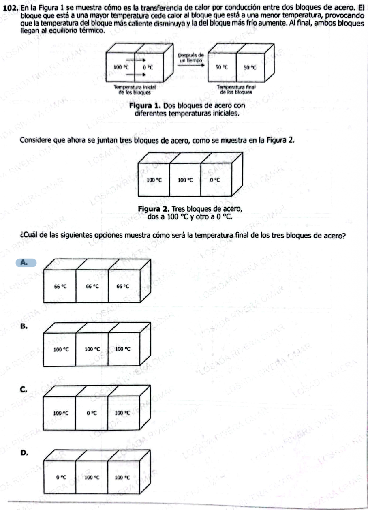

**102.** En la Figura 1 se muestra cómo es la transferencia de calor por conducción entre dos bloques de acero. El bloque que está a una mayor temperatura cede calor al bloque que está a una menor temperatura, provocando que la temperatura del bloque más caliente disminuya y la del bloque más frío aumente. Al final, ambos bloques llegan al equilibrio térmico.

---

### Figura 1
*(Parte superior de la imagen)*  
- Dos bloques de acero: uno a **100 °C** y otro a **0 °C**.  
- Después de un tiempo, ambos alcanzan la **misma temperatura: 50 °C**.  

---

Considere que ahora se juntan tres bloques de acero, como se muestra en la Figura 2.

### Figura 2
*(Parte media de la imagen)*  
- Tres bloques de acero:  
  - Dos bloques a **100 °C**  
  - Un bloque a **0 °C**

---

¿Cuál de las siguientes opciones muestra cómo será la temperatura final de los tres bloques de acero?

---

### Opción A
Tres bloques a **66 °C, 66 °C y 66 °C**  

---

### Opción B
Tres bloques a **100 °C, 100 °C y 100 °C**  

---

### Opción C
Bloques a **100 °C, 0 °C y 100 °C**  

---

### Opción D
Bloques a **0 °C, 

Excelente — esta es **nivel ICFES alto++** (mezcla de conservación + razonamiento proporcional sin fórmula explícita).

Voy completo con tu formato 👇

***

# ✅ 1) ¿Qué está evaluando?

### 🔍 Conceptos clave:

* **Transferencia de calor (conducción)**
* **Equilibrio térmico**
* **Conservación de energía térmica**

***

### 🧠 Habilidad:

* Generalizar a partir de un caso simple (2 bloques → 3 bloques)
* Hacer promedio ponderado **sin fórmula explícita**
* Interpretar equilibrio

***

### ⚠️ Trampa ICFES:

Pensar que:

* La temperatura final es la del más caliente ❌
* O que depende de posición ❌

👉 La clave es:

> **Todos terminan con la MISMA temperatura**

***

# ✅ Análisis paso a paso

## 🔹 Caso 1 (figura 1):

* 100°C + 0°C → final = 50°C

👉 Promedio simple ✅

***

## 🔹 Caso 2 (figura 2):

Tres bloques:

* 100°C
* 100°C
* 0°C

***

## 🧠 Idea clave:

Todos son del mismo material → mismo comportamiento

👉 Temperatura final = promedio:

$$
T_f = \frac{100 + 100 + 0}{3} = \frac{200}{3} ≈ 66.7°C
$$

***

# ✅ Respuesta pregunta original

### ✔️ Respuesta correcta: **A**

***

# ✅ Explicación:

* Dos bloques calientes → aportan más energía
* Uno frío → absorbe

👉 Se equilibran en un valor intermedio  
👉 Aproximadamente 66°C

***

### ❌ Opciones incorrectas:

* **B:** todos quedan en 100°C ❌ imposible
* **C:** no hay equilibrio ❌ falso
* **D:** depende del orden ❌ falso

***

# ✅ 2) Teoría (ICFES directa)

## 🔥 Equilibrio térmico

Cuando objetos se conectan:

* El calor fluye de caliente → frío
* Hasta que todos tengan **misma temperatura**

***

## 🎯 Conservación de energía

$$
\text{Calor perdido} = \text{Calor ganado}
$$

***

## 🧠 Resultado clave

Para mismo material y tamaño:

$$
T_f = \text{promedio de temperaturas}
$$

***

## ✅ Ejemplos

### Ejemplo 1:

100 + 0 → 50

***

### Ejemplo 2:

100 + 100 + 0 → \~66

***

### Ejemplo 3:

50 + 50 + 0 → \~33

***

# ✅ 3) Preguntas Conceptuales

1. ¿Qué es equilibrio térmico?
2. ¿Qué ocurre entre cuerpos a distinta temperatura?
3. ¿Hacia dónde fluye el calor?
4. ¿Qué pasa al final del proceso?
5. ¿Qué se conserva?
6. ¿Qué ocurre con la temperatura final?
7. ¿Qué pasa si los materiales son iguales?
8. ¿Qué significa promedio térmico?
9. ¿Qué ocurre si hay más bloques calientes?
10. ¿Qué pasa si hay más bloques fríos?
11. ¿Qué variable determina el equilibrio?
12. ¿Qué ocurre con la energía?
13. ¿Qué representa la temperatura?
14. ¿Qué pasa si todos están a misma temperatura?
15. ¿Qué controla el valor final?

***

# ✅ Respuestas Conceptuales

1. Igualdad de temperatura
2. Intercambio de calor
3. Caliente a frío
4. Se igualan
5. Energía
6. Es única
7. Promedio
8. Media de valores
9. Aumenta la final
10. Disminuye la final
11. Energía total
12. Se conserva
13. Energía térmica
14. Nada cambia
15. Suma de energías

***

# ✅ 4) Preguntas tipo ICFES

***

### 1.

El calor fluye de:

A. Frío a caliente  
B. Caliente a frío  
C. Igual  
D. Aleatorio

***

### 2.

En equilibrio térmico:

A. Temperaturas distintas  
B. Temperaturas iguales  
C. Energía cero  
D. Movimiento nulo

***

### 3.

Tres cuerpos iguales tienden a:

A. Diferentes temperaturas  
B. Misma temperatura  
C. Cero temperatura  
D. Máxima temperatura

***

### 4.

La temperatura final depende de:

A. Orden  
B. Promedio  
C. Tiempo  
D. Posición

***

### 5.

Más cuerpos calientes implica:

A. Menor temperatura final  
B. Mayor temperatura final  
C. Igual  
D. Cero

***

### 6.

El calor es:

A. Sustancia  
B. Energía  
C. Materia  
D. Fuerza

***

### 7.

Si todos son iguales:

A. No intercambian calor  
B. Promedian  
C. Se congelan  
D. Se calientan

***

### 8.

Equilibrio ocurre cuando:

A. Se detiene el calor  
B. Igual temperatura  
C. Diferente presión  
D. Cambio constante

***

### 9.

La energía térmica:

A. Desaparece  
B. Se conserva  
C. Aumenta  
D. Disminuye

***

### 10.

Un cuerpo frío:

A. Da calor  
B. Recibe calor  
C. No cambia  
D. Genera energía

***

### 11.

Dos cuerpos iguales → resultado:

A. Diferente  
B. Promedio  
C. Cero  
D. Mayor

***

### 12.

La temperatura mide:

A. Volumen  
B. Energía interna  
C. Masa  
D. Tiempo

***

### 13.

El sistema busca:

A. Máxima temperatura  
B. Equilibrio  
C. Caos  
D. Movimiento

***

### 14.

La conducción ocurre por:

A. Movimiento  
B. Contacto  
C. Luz  
D. Sonido

***

### 15.

Si hay más frío:

A. Sube temperatura final  
B. Baja temperatura final  
C. Igual  
D. Desaparece

***

# ✅ Respuestas Preguntas ICFES

1. B
2. B
3. B
4. B
5. B
6. B
7. B
8. B
9. B
10. B
11. B
12. B
13. B
14. B
15. B

***

# 🎯 CLAVE DE ORO

> **Temperatura final = promedio (si todo es igual)**

***

