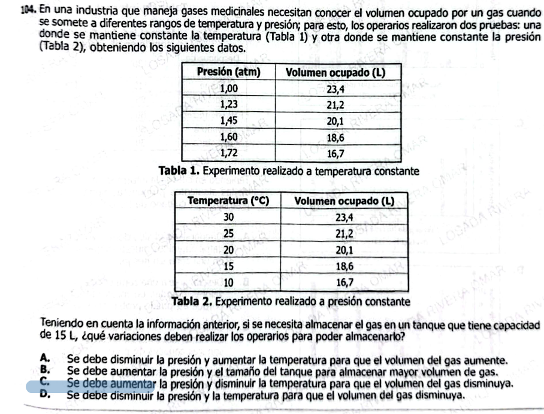

**104.** En una industria que maneja gases medicinales necesitan conocer el volumen ocupado por un gas cuando se somete a diferentes rangos de temperatura y presión; para esto, los operarios realizaron dos pruebas: una donde se mantiene constante la temperatura (Tabla 1) y otra donde se mantiene constante la presión (Tabla 2), obteniendo los siguientes datos.

---

### Tabla 1. Experimento realizado a temperatura constante

| Presión (atm) | Volumen ocupado (L) |
|---------------|---------------------|
| 1,00          | 23,4                |
| 1,23          | 21,2                |
| 1,45          | 20,1                |
| 1,60          | 18,6                |
| 1,72          | 16,7                |

---

### Tabla 2. Experimento realizado a presión constante

| Temperatura (°C) | Volumen ocupado (L) |
|-------------------|---------------------|
| 30                | 23,4                |
| 25                | 21,2                |
| 20                | 20,1                |
| 15                | 18,6                |
| 10                | 16,7                |

---

Teniendo en cuenta la información anterior, si se necesita almacenar el gas en un tanque que tiene capacidad de **15 L**, ¿qué variaciones deben realizar los operarios para poder almacenarlo?

---

### Opción A
Se debe disminuir la presión y aumentar la temperatura para que el volumen del gas aumente.  

### Opción B
Se debe aumentar la presión y el tamaño del tanque para almacenar mayor volumen de gas.  

### Opción C
Se debe aumentar la presión y disminuir la temperatura para que el volumen del gas disminuya.  

### Opción D
Se debe disminuir la presión y la temperatura para que el volumen del gas disminuya.  

Excelente — esta es de las más completas porque **integra TODO lo anterior**:

* Ley de Boyle (P–V)
* Ley de Charles (T–V)
* Interpretación de tablas
* Decisión aplicada

Vamos completo 👇

***

# ✅ 1) ¿Qué está evaluando?

### 🔍 Conceptos clave:

* Relación entre:
  * **Presión y volumen (inversa)**
  * **Temperatura y volumen (directa)**

***

### 🧠 Habilidad:

* Leer tablas y detectar patrones
* Integrar dos experimentos distintos
* Tomar una decisión práctica

***

### ⚠️ Trampa ICFES:

Pensar en **una sola variable**:

* “Solo subir temperatura” ❌
* “Solo bajar presión” ❌

👉 Aquí hay que **combinar ambas para reducir volumen**

***

# ✅ Análisis de las tablas

## 🔹 TABLA 1 (temperatura constante)

| Presión ↑       | Volumen ↓     |
| --------------- | ------------- |
| 1.00 → 1.72 atm | 23.4 → 16.7 L |

👉 **Relación inversa**

***

## 🔹 TABLA 2 (presión constante)

| Temperatura ↓ | Volumen ↓     |
| ------------- | ------------- |
| 30 → 10 °C    | 23.4 → 16.7 L |

👉 **Relación directa**

***

# ✅ Objetivo

👉 Necesitan **bajar el volumen a 15 L**

Entonces deben:

* Disminuir volumen más aún (actual mínimo \~16.7 L)

***

# ✅ Estrategia correcta

Para disminuir volumen:

✅ Aumentar presión  
✅ Disminuir temperatura

***

# ✅ Respuesta pregunta original

### ✔️ Respuesta correcta: **C**

***

# ✅ Explicación:

* Más presión → comprime el gas
* Menor temperatura → reduce movimiento

👉 Ambas acciones reducen volumen

***

### ❌ Opciones incorrectas:

* **A:** reduce presión → aumenta volumen ❌
* **B:** habla de tanque, no físico ❌
* **D:** bajar presión aumenta volumen ❌

***

# ✅ 2) Teoría (ICFES directa)

## ⚡ Ley de Boyle

$$
V \propto \frac{1}{P}
$$

***

## 🔥 Ley de Charles

$$
V \propto T
$$

***

## 🎯 Regla combinada clave

| Acción        | Volumen   |
| ------------- | --------- |
| ↑ Presión     | ↓ Volumen |
| ↑ Temperatura | ↑ Volumen |

***

## 🧠 Estrategia ICFES

> Para reducir volumen → combina:
>
> * ↑ Presión
> * ↓ Temperatura

***

## ✅ Ejemplos

### Ejemplo 1:

Subir presión → volumen baja

***

### Ejemplo 2:

Bajar temperatura → volumen baja

***

### Ejemplo 3:

Ambas → efecto más fuerte

***

# ✅ 3) Preguntas Conceptuales

1. ¿Qué ocurre si aumenta la presión?
2. ¿Qué ocurre si aumenta la temperatura?
3. ¿Qué relación hay entre P y V?
4. ¿Qué relación hay entre T y V?
5. ¿Qué disminuye el volumen?
6. ¿Por qué la presión reduce volumen?
7. ¿Qué ocurre si baja temperatura?
8. ¿Qué hacen las partículas al enfriarse?
9. ¿Qué sucede al comprimir un gas?
10. ¿Qué variable controla el espacio?
11. ¿Qué ley describe P–V?
12. ¿Qué ley describe T–V?
13. ¿Qué ocurre si ambas variables bajan?
14. ¿Qué ocurre si ambas suben?
15. ¿Cómo se reduce el volumen más rápido?

***

# ✅ Respuestas Conceptuales

1. Disminuye volumen
2. Aumenta volumen
3. Inversa
4. Directa
5. Alta presión y baja temperatura
6. Acerca partículas
7. Disminuye volumen
8. Se mueven menos
9. Reduce espacio
10. Presión
11. Boyle
12. Charles
13. Puede equilibrarse
14. Aumenta volumen
15. Aumentando presión y bajando temperatura

***

# ✅ 4) Preguntas tipo ICFES

***

### 1.

Si aumenta la presión:

A. V sube  
B. V baja  
C. V igual  
D. V desaparece

***

### 2.

Si aumenta temperatura:

A. V baja  
B. V sube  
C. V igual  
D. V cero

***

### 3.

Relación P–V es:

A. Directa  
B. Inversa  
C. Lineal  
D. Constante

***

### 4.

Relación T–V es:

A. Inversa  
B. Directa  
C. Nula  
D. Variable

***

### 5.

Reducir volumen requiere:

A. Baja presión  
B. Alta presión  
C. Alta temperatura  
D. Baja presión

***

### 6.

Enfriar gas produce:

A. Expansión  
B. Contracción  
C. Igual  
D. Ruptura

***

### 7.

Comprimir gas implica:

A. Aumentar volumen  
B. Disminuir volumen  
C. Igual  
D. Calentar

***

### 8.

Ley de Boyle aplica cuando:

A. T constante  
B. P constante  
C. V constante  
D. Nada constante

***

### 9.

Ley de Charles aplica cuando:

A. T constante  
B. P constante  
C. V constante  
D. Nula

***

### 10.

Para mínimo volumen:

A. Baja P, alta T  
B. Alta P, baja T  
C. Alta P, alta T  
D. Baja P, baja T

***

### 11.

Mayor presión genera:

A. Más espacio  
B. Menos espacio  
C. Igual  
D. Nada

***

### 12.

Mayor temperatura genera:

A. Menor volumen  
B. Mayor volumen  
C. Igual  
D. Nada

***

### 13.

Las partículas al enfriarse:

A. Aumentan velocidad  
B. Disminuyen velocidad  
C. Desaparecen  
D. Cambian masa

***

### 14.

Las variables clave son:

A. Color  
B. Presión y temperatura  
C. Tiempo  
D. Energía

***

### 15.

El volumen depende de:

A. Masa  
B. P y T  
C. Tiempo  
D. Forma

***

# ✅ Respuestas Preguntas ICFES

1. B
2. B
3. B
4. B
5. B
6. B
7. B
8. A
9. B
10. B
11. B
12. B
13. B
14. B
15. B

***

# 🎯 CLAVE DE ORO (muy importante)

> **Para reducir volumen:**
> ✅ ↑ Presión  
> ✅ ↓ Temperatura

***
