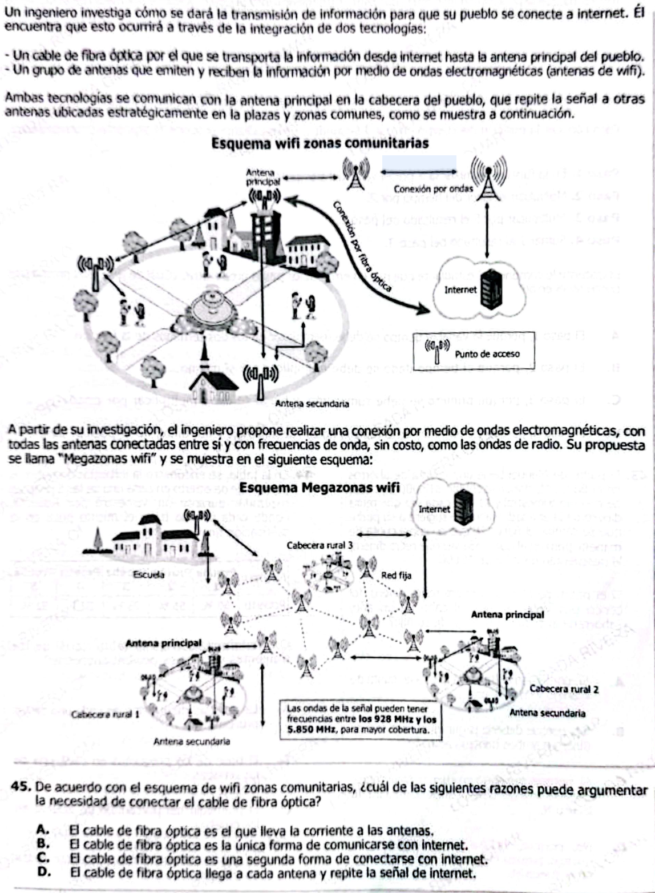

**45.** Un ingeniero investiga cómo se dará la transmisión de información para que su pueblo se conecte a internet. Él encuentra que esto ocurrirá a través de la integración de dos tecnologías:

- Un cable de fibra óptica por el que se transporta la información desde internet hasta la antena principal del pueblo.  
- Un grupo de antenas que emiten y reciben la información por medio de ondas electromagnéticas (antenas de wifi).

Ambas tecnologías se comunican con la antena principal en la cabecera del pueblo, que repite la señal a otras antenas ubicadas estratégicamente en las plazas y zonas comunes, como se muestra a continuación.

**Esquema wifi zonas comunitarias**

*(ver imagen)*

A partir de su investigación, el ingeniero propone realizar una conexión por medio de ondas electromagnéticas, con todas las antenas conectadas entre sí y con frecuencias de onda, sin costo, como las ondas de radio. Su propuesta se llama "Megazonas wifi" y se muestra en el siguiente esquema:

**Esquema Megazonas wifi**

*(ver imagen)*

---

De acuerdo con el esquema de wifi zonas comunitarias, ¿cuál de las siguientes razones puede argumentar la necesidad de conectar el cable de fibra óptica?

A. El cable de fibra óptica es el que lleva la corriente a las antenas.  
B. El cable de fibra óptica es la única forma de comunicarse con internet.  
C. El cable de fibra óptica es una segunda forma de conectarse con internet.  
D. El cable de fibra óptica llega a cada antena y repite la señal de internet.  

# ✅ 1) ¿Qué está evaluando esta pregunta?

### 🔍 Conceptos clave:

* Medios de transmisión de información
* Fibra óptica vs ondas electromagnéticas
* Función de cada componente en un sistema tecnológico

### 🧠 Habilidad:

* Interpretación de esquemas
* Identificación de funciones dentro de un sistema

### ⚠️ Trampa:

Confundir funciones:

* Fibra ≠ corriente
* Antena ≠ fuente de internet

***

# ✅ Respuesta pregunta original

**Respuesta correcta: B**

***

# ✅ 2) Teoría (clara y directa)

## 🌐 Tipos de transmisión

### 🔌 Fibra óptica

* Usa luz
* Alta velocidad
* Conecta con internet global

### 📡 Ondas electromagnéticas

* No usan cables
* Distribuyen señal
* Alcance limitado

***

## 🎯 Idea clave ICFES

> **Fibra conecta → Antenas distribuyen**

***

## ✅ Ejemplos

* Sin fibra → no hay internet
* Sin antenas → no hay cobertura local
* Interferencia → afecta solo ondas

***

# ✅ 3) Preguntas conceptuales

1. ¿Por qué la fibra es mejor para largas distancias?
2. ¿Por qué las antenas necesitan fibra?
3. ¿Qué pasa si solo hay antenas?
4. ¿Qué medio usa el WiFi?
5. ¿Qué tecnología es más afectada por obstáculos?
6. ¿Qué hace la antena principal?
7. ¿Por qué no usar solo fibra?
8. ¿Qué transmite la fibra?
9. ¿Qué pasa si falla la antena principal?
10. ¿Por qué hay varias antenas?
11. ¿Qué tipo de señal es WiFi?
12. ¿Dónde se distribuye la señal?
13. ¿Cuál permite movilidad?
14. ¿Cuál conecta con internet global?
15. ¿Qué pasa si hay interferencia?

***

# ✅ Respuestas Preguntas Conceptuales

1. Porque pierde poca energía (usa luz).
2. Porque la fibra trae internet global.
3. No habría acceso a internet.
4. Ondas electromagnéticas.
5. Ondas electromagnéticas.
6. Recibe y distribuye señal.
7. No es práctico para cobertura local.
8. Luz (información codificada).
9. Se cae toda la red local.
10. Para ampliar cobertura.
11. Electromagnética.
12. En antenas.
13. Ondas electromagnéticas.
14. Fibra óptica.
15. Se afecta la señal inalámbrica.

***

# ✅ 4) Preguntas tipo ICFES

### 1.

Si se elimina la fibra, el sistema:
A. Mejora  
B. Pierde internet  
C. Aumenta señal  
D. No cambia

***

### 2.

La función de la antena es:
A. Generar internet  
B. Distribuir señal  
C. Crear energía  
D. Almacenar datos

***

### 3.

La fibra se caracteriza por:
A. Bajo costo  
B. Alta velocidad  
C. Movilidad  
D. Corto alcance

***

### 4.

Varias antenas permiten:
A. Menos interferencia  
B. Mayor cobertura  
C. Menos usuarios  
D. Más cable

***

### 5.

El WiFi usa:
A. Luz  
B. Corriente  
C. Ondas  
D. Sonido

***

### 6.

Si falla una antena secundaria:
A. Todo falla  
B. Zona puntual falla  
C. Internet cae  
D. Fibra falla

***

### 7.

La fibra transmite:
A. Electricidad  
B. Luz  
C. Sonido  
D. Aire

***

### 8.

El nodo principal es:
A. Usuario  
B. Antena principal  
C. Router  
D. Servidor

***

### 9.

La red es:
A. Lineal  
B. Aislada  
C. Jerárquica  
D. Cerrada

***

### 10.

Ventaja de ondas:
A. Velocidad  
B. Bajo costo  
C. Estabilidad  
D. Seguridad

***

### 11.

Interferencia afecta:
A. Fibra  
B. Ondas  
C. Internet  
D. Datos

***

### 12.

Internet depende de:
A. Antenas  
B. Fibra  
C. Usuarios  
D. Señales

***

### 13.

El sistema funciona por:
A. Repetición  
B. Integración  
C. Aislamiento  
D. Simplificación

***

### 14.

Las antenas se ubican para:
A. Reducir costo  
B. Aumentar cobertura  
C. Reducir velocidad  
D. Evitar usuarios

***

### 15.

La fibra es:
A. Aire  
B. Guiada  
C. Libre  
D. Débil

***

# ✅ Respuestas Preguntas ICFES

1. B
2. B
3. B
4. B
5. C
6. B
7. B
8. B
9. C
10. B
11. B
12. B
13. B
14. B
15. B

***

