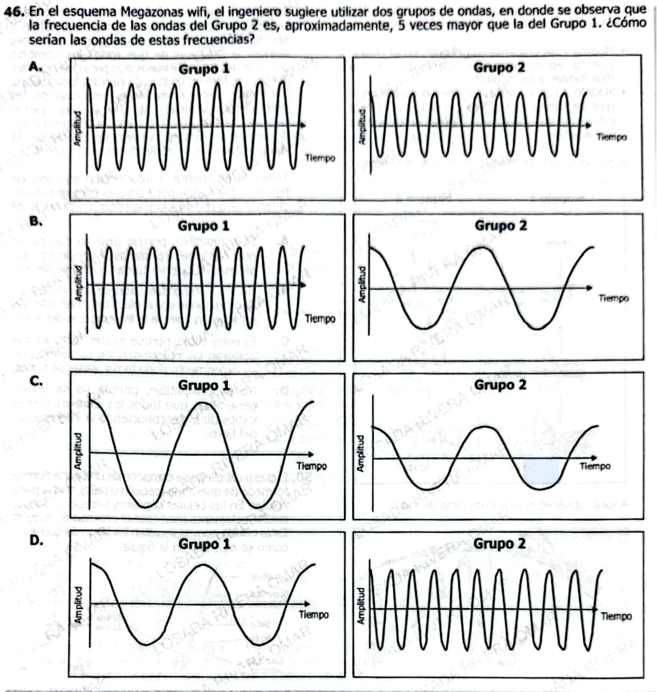

**46.** En el esquema Megazonas wifi, el ingeniero sugiere utilizar dos grupos de ondas, en donde se observa que la frecuencia de las ondas del Grupo 2 es, aproximadamente, **5 veces mayor** que la del Grupo 1. ¿Cómo serían las ondas de estas frecuencias?

---

### Opción A
**Grupo 1:** onda con alta frecuencia (muchas oscilaciones en el mismo intervalo de tiempo)  
**Grupo 2:** onda con frecuencia similar o ligeramente menor que Grupo 1  

---

### Opción B
**Grupo 1:** onda con alta frecuencia  
**Grupo 2:** onda con baja frecuencia (pocas oscilaciones)  

---

### Opción C
**Grupo 1:** onda con baja frecuencia  
**Grupo 2:** onda con frecuencia similar a Grupo 1  

---

### Opción D
**Grupo 1:** onda con baja frecuencia (pocas oscilaciones)  
**Grupo 2:** onda con alta frecuencia (muchas más oscilaciones, aproximadamente 5 veces mayor)  

---

***

# ✅ 1) ¿Qué está evaluando esta pregunta?

### 🔍 Concepto clave:

* **Frecuencia de ondas**
* Relación entre:
  * frecuencia ↑ → más ciclos en el mismo tiempo
  * frecuencia ↓ → menos ciclos

***

### 🧠 Habilidad:

* Interpretar gráficos (amplitud vs tiempo)
* Comparar **densidad de ondas**
* Razonamiento proporcional

***

### ⚠️ Trampa ICFES:

Confundir:

* **Amplitud ≠ frecuencia**
* Tamaño de la onda ≠ número de oscilaciones

👉 Aquí NO importa qué tan alta es la onda, sino **cuántas veces oscila**

***

# ✅ Respuesta pregunta original

### ✔️ Respuesta correcta: **D**

***

### ✅ Explicación clara:

El enunciado dice:

> Grupo 2 tiene una frecuencia **5 veces mayor** que Grupo 1

👉 Eso significa:

* Grupo 2 debe tener muchas más oscilaciones en el mismo tiempo
* Aproximadamente 5 veces más ciclos

***

### 🔍 Revisión de opciones:

* **A:** Frecuencias parecidas ❌
* **B:** Grupo 2 más lento ❌
* **C:** Frecuencias similares ❌
* **D:** Grupo 2 mucho más denso ✅

✔️ Es la única donde claramente hay muchas más oscilaciones

***

# ✅ 2) Teoría (ICFES-style)

## 🌊 Frecuencia

### Definición:

Número de ciclos por unidad de tiempo

$$
f = \frac{\text{número de ciclos}}{\text{tiempo}}
$$

***

## 🎯 Relación clave

| Concepto        | Qué pasa         |
| --------------- | ---------------- |
| Alta frecuencia | Más ondas juntas |
| Baja frecuencia | Ondas separadas  |

***

## ⚠️ Error común

* Amplitud (altura) → energía
* Frecuencia → rapidez de oscilación

👉 NO son lo mismo

***

## ✅ Ejemplos

### Ejemplo 1:

Más ondas en el mismo espacio → mayor frecuencia

***

### Ejemplo 2:

Menos ondas → menor frecuencia

***

### Ejemplo 3:

Misma altura pero más juntas → mayor frecuencia

***

# ✅ 3) Preguntas Conceptuales

1. ¿Qué mide la frecuencia?
2. ¿Qué ocurre si aumenta la frecuencia?
3. ¿La amplitud cambia la frecuencia?
4. ¿Qué indica ondas más juntas?
5. ¿Qué indica ondas más separadas?
6. ¿Qué pasa si hay más ciclos en el mismo tiempo?
7. ¿Frecuencia alta implica mayor energía?
8. ¿Qué cambia cuando aumenta frecuencia?
9. ¿Qué variable se mantiene constante en comparación visual?
10. ¿Qué pasa con la longitud de onda al aumentar frecuencia?
11. ¿Qué relación hay entre frecuencia y número de ciclos?
12. ¿Cómo se identifica mayor frecuencia en un gráfico?
13. ¿Qué diferencia clave hay entre amplitud y frecuencia?
14. ¿Una onda lenta tiene alta o baja frecuencia?
15. ¿Qué significa frecuencia 5 veces mayor?

***

# ✅ Respuestas Conceptuales

1. Número de ciclos por tiempo
2. Más oscilaciones
3. No
4. Alta frecuencia
5. Baja frecuencia
6. Aumenta la frecuencia
7. No necesariamente
8. Número de ciclos
9. Tiempo
10. Disminuye
11. Proporcional
12. Más ciclos en mismo tiempo
13. Altura vs repetición
14. Baja frecuencia
15. 5 veces más ciclos

***

# ✅ 4) Preguntas tipo ICFES

***

### 1.

Una onda con mayor frecuencia tiene:

A. Menos ciclos  
B. Más ciclos  
C. Mayor altura  
D. Mayor energía

***

### 2.

Si una onda duplica su frecuencia:

A. Tiene la mitad de ciclos  
B. Tiene el doble de ciclos  
C. Cambia amplitud  
D. Desaparece

***

### 3.

Ondas más juntas significan:

A. Menor frecuencia  
B. Igual frecuencia  
C. Mayor frecuencia  
D. Menor energía

***

### 4.

Frecuencia depende de:

A. Altura  
B. Ciclos  
C. Color  
D. Tamaño

***

### 5.

Si hay menos ciclos:

A. Alta frecuencia  
B. Igual frecuencia  
C. Baja frecuencia  
D. Mayor amplitud

***

### 6.

La amplitud mide:

A. Frecuencia  
B. Velocidad  
C. Altura  
D. Ciclos

***

### 7.

Frecuencia alta implica:

A. Ondas separadas  
B. Ondas densas  
C. Ondas lentas  
D. Ondas bajas

***

### 8.

Al aumentar frecuencia:

A. Disminuyen ciclos  
B. Aumentan ciclos  
C. Desaparece onda  
D. Cambia dirección

***

### 9.

Comparar frecuencia requiere:

A. Ver altura  
B. Ver ciclos  
C. Ver color  
D. Ver tamaño

***

### 10.

Frecuencia es:

A. Energía  
B. Velocidad  
C. Repetición  
D. Altura

***

### 11.

Ondas lentas tienen:

A. Alta frecuencia  
B. Baja frecuencia  
C. Igual frecuencia  
D. Alta amplitud

***

### 12.

Si una onda es 3 veces más frecuente:

A. 3 veces más alta  
B. 3 veces más ciclos  
C. 3 veces más larga  
D. 3 veces más energía

***

### 13.

Frecuencia alta se observa como:

A. Ondas separadas  
B. Ondas juntas  
C. Ondas largas  
D. Ondas bajas

***

### 14.

Comparar frecuencia implica mirar:

A. Tiempo  
B. Ciclos  
C. Ambos  
D. Ninguno

***

### 15.

Si dos ondas tienen mismo número de ciclos:

A. Igual frecuencia  
B. Diferente frecuencia  
C. Igual amplitud  
D. Diferente energía

***

# ✅ Respuestas Preguntas ICFES

1. B
2. B
3. C
4. B
5. C
6. C
7. B
8. B
9. B
10. C
11. B
12. B
13. B
14. C
15. A

***

# 🎯 CLAVE DE ORO (memorizar para examen)

> **Más ondas en el mismo espacio = mayor frecuencia**

***
