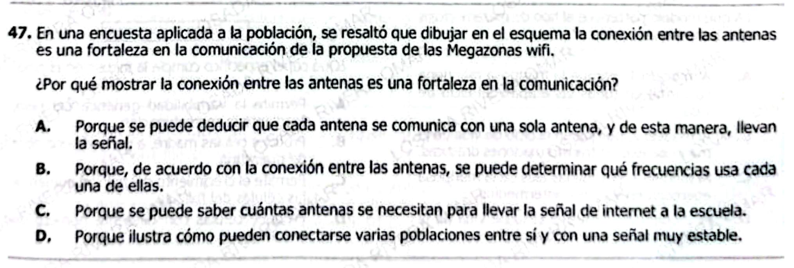

**47.** En una encuesta aplicada a la población, se resaltó que dibujar en el esquema la conexión entre las antenas es una fortaleza en la comunicación de la propuesta de las Megazonas wifi.

¿Por qué mostrar la conexión entre las antenas es una fortaleza en la comunicación?

A. Porque se puede deducir que cada antena se comunica con una sola antena, y de esta manera, llevan la señal.  

B. Porque, de acuerdo con la conexión entre las antenas, se puede determinar qué frecuencias usa cada una de ellas.  

C. Porque se puede saber cuántas antenas se necesitan para llevar la señal de internet a la escuela.  

D. Porque ilustra cómo pueden conectarse varias poblaciones entre sí y con una señal muy estable.  

Vamos con esta — aquí el ICFES sube el nivel: ya no es física pura, sino **comunicación de modelos + interpretación de representaciones**.

***

# ✅ 1) ¿Qué está evaluando esta pregunta?

### 🔍 Conceptos clave:

* **Representación gráfica de sistemas**
* **Comunicación efectiva de ideas**
* **Redes (interconexión entre nodos)**

***

### 🧠 Habilidad:

* Interpretación de **diagramas como herramientas de comunicación**
* Evaluar **para qué sirve una representación**, no solo qué muestra

***

### ⚠️ Trampa ICFES:

Quieren que confundas:

* Detalles técnicos (frecuencias, cantidad exacta de antenas) ❌  
  con
* **Propósito comunicativo del esquema** ✅

👉 La pregunta NO es técnica, es de **comunicación de la idea**

***

# ✅ Respuesta pregunta original

### ✔️ Respuesta correcta: **D**

***

### ✅ Explicación:

El esquema muestra **cómo las antenas están conectadas entre sí y entre poblaciones**.

👉 Eso permite entender:

* Que **no es una red aislada**
* Que hay **interconexión y estabilidad**

✔️ Por eso, es una fortaleza comunicativa:
→ permite visualizar el sistema completo funcionando

***

### ❌ Por qué las otras están mal:

* **A:** Dice que cada antena solo se conecta con una → ❌ el esquema muestra múltiples conexiones
* **B:** Habla de frecuencias → ❌ eso no se deduce del dibujo
* **C:** Habla de cantidad exacta → ❌ el esquema no es para contar implementación

***

# ✅ 2) Teoría (ICFES-style)

## 📊 Representaciones en ciencia y tecnología

Los diagramas sirven para:

| Función    | Qué permiten                    |
| ---------- | ------------------------------- |
| Explicar   | Cómo funciona un sistema        |
| Visualizar | Relaciones entre elementos      |
| Comunicar  | Ideas complejas de forma simple |

***

## 🌐 Redes

Una red tiene:

* **Nodos** (antenas)
* **Conexiones** (enlaces)

***

## 🎯 Idea clave

> **Un buen esquema comunica relaciones, no detalles técnicos innecesarios**

***

## ✅ Ejemplos

### Ejemplo 1:

Un mapa de metro → muestra conexiones, no velocidad

***

### Ejemplo 2:

Un circuito → muestra flujo, no materiales

***

### Ejemplo 3:

Red WiFi → muestra cobertura, no frecuencia exacta

***

# ✅ 3) Preguntas Conceptuales

1. ¿Qué función tiene un esquema en ciencia?
2. ¿Qué tipo de información se comunica mejor visualmente?
3. ¿Qué representa una conexión entre nodos?
4. ¿Qué NO muestra un esquema típicamente?
5. ¿Por qué es útil visualizar redes?
6. ¿Qué permite entender un diagrama de red?
7. ¿Qué significa que varios nodos estén conectados?
8. ¿Qué tipo de información se omite en estos esquemas?
9. ¿Por qué no se muestran frecuencias en el dibujo?
10. ¿Qué hace un esquema claro?
11. ¿Qué se prioriza en comunicación visual?
12. ¿Qué representa un nodo?
13. ¿Qué indica múltiples conexiones?
14. ¿Qué ventaja tiene lo visual vs texto?
15. ¿Qué tipo de error es enfocarse en detalles irrelevantes?

***

# ✅ Respuestas Conceptuales

1. Explicar sistemas
2. Relaciones
3. Comunicación/interacción
4. Detalles técnicos específicos
5. Comprender relaciones
6. Cómo interactúan elementos
7. Red interconectada
8. Datos exactos (frecuencia, números)
9. No es necesario para el objetivo
10. Simplicidad y claridad
11. Relaciones
12. Un punto del sistema
13. Red robusta
14. Mayor rapidez de comprensión
15. Error de interpretación

***

# ✅ 4) Preguntas tipo ICFES

***

### 1.

Un esquema es útil porque:

A. Da todos los datos  
B. Resume relaciones  
C. Mide variables  
D. Calcula resultados

***

### 2.

Mostrar conexiones permite:

A. Ver frecuencia  
B. Entender relaciones  
C. Medir señales  
D. Contar nodos

***

### 3.

Un nodo representa:

A. Energía  
B. Punto en red  
C. Tiempo  
D. Frecuencia

***

### 4.

Los esquemas evitan:

A. Claridad  
B. Complejidad innecesaria  
C. Interpretación  
D. Visualización

***

### 5.

La red mostrada es:

A. Aislada  
B. Interconectada  
C. Lineal  
D. Simple

***

### 6.

El objetivo principal es:

A. Medir frecuencia  
B. Mostrar funcionamiento  
C. Calcular energía  
D. Mostrar números

***

### 7.

Las conexiones indican:

A. Tamaño  
B. Relación  
C. Color  
D. Peso

***

### 8.

Un error sería interpretar:

A. Relaciones  
B. Número exacto  
C. Conexiones  
D. Integración

***

### 9.

La visualización ayuda a:

A. Complicar  
B. Simplificar  
C. Medir  
D. Calcular

***

### 10.

Un buen esquema debe:

A. Tener muchos datos  
B. Ser claro  
C. Ser largo  
D. Ser técnico

***

### 11.

Las redes permiten:

A. Aislar  
B. Conectar  
C. Reducir  
D. Eliminar

***

### 12.

Una conexión indica:

A. Separación  
B. Interacción  
C. Distancia  
D. Tiempo

***

### 13.

El esquema comunica:

A. Frecuencias  
B. Relaciones  
C. Materiales  
D. Costos

***

### 14.

Un esquema es mejor cuando:

A. Es complejo  
B. Es claro  
C. Es grande  
D. Es detallado

***

### 15.

El enfoque correcto es:

A. Detalles  
B. Relaciones  
C. Cálculos  
D. Datos

***

# ✅ Respuestas Preguntas ICFES

1. B
2. B
3. B
4. B
5. B
6. B
7. B
8. B
9. B
10. B
11. B
12. B
13. B
14. B
15. B

***

# 🎯 CLAVE DE ORO

> **ICFES ama preguntar: "¿para qué sirve el esquema?" → respuesta casi siempre: mostrar relaciones**

***
