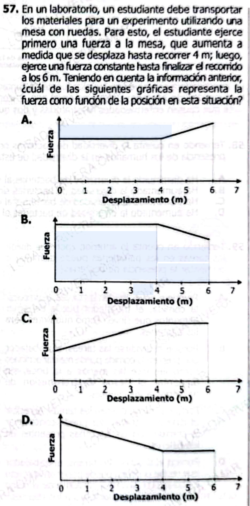

**57.** En un laboratorio, un estudiante debe transportar los materiales para un experimento utilizando una mesa con ruedas. Para esto, el estudiante ejerce primero una fuerza a la mesa, que **aumenta a medida que se desplaza hasta recorrer 4 m**; luego, ejerce una **fuerza constante** hasta finalizar el recorrido a los 6 m. 

Teniendo en cuenta la información anterior, ¿cuál de las siguientes gráficas representa la fuerza como función de la posición en esta situación?

**Opciones:**

**A.** Fuerza constante desde 0 hasta 4 m, luego aumenta de 4 a 6 m.  

**B.** Fuerza constante desde 0 hasta 4 m, luego disminuye de 4 a 6 m.  

**C.** Fuerza aumenta desde 0 hasta 4 m, luego se mantiene constante de 4 a 6 m.  

**D.** Fuerza disminuye desde 0 hasta 4 m, luego se mantiene constante de 4 a 6 m.  

Excelente — este es **nivel clásico ICFES alto**: mezcla **traducción texto → gráfica** (muy frecuente en el examen).

***

# ✅ 1) ¿Qué está evaluando?

### 🔍 Conceptos clave:

* **Fuerza vs posición**
* Interpretación de **gráficas**
* Cambio de comportamiento (tramos)

***

### 🧠 Habilidad:

* Traducir texto a gráfica
* Identificar **función por tramos**
* Interpretar tendencia (crece / constante)

***

### ⚠️ Trampa ICFES:

Confundir:

* Tiempo vs posición ❌
* Orden de los eventos ❌

👉 Aquí todo es **Fuerza en función del desplazamiento**

***

# ✅ Transcripción exacta del problema (clave)

1. De 0 a 4 m:
   👉 **la fuerza aumenta**

2. De 4 a 6 m:
   👉 **la fuerza es constante**

***

# ✅ Respuesta pregunta original

### ✔️ Respuesta correcta: **C**

***

### ✅ Explicación:

Buscamos:

* Primer tramo → línea creciente ✅
* Segundo tramo → línea horizontal ✅

***

### 🔍 Análisis opciones:

* **A:** primero constante, luego crece ❌
* **B:** primero constante, luego disminuye ❌
* **C:** primero crece, luego constante ✅ ✅
* **D:** primero disminuye ❌

***

# ✅ 2) Teoría (ICFES directa)

## 📈 Funciones por tramos

Una variable cambia de forma distinta en diferentes intervalos.

***

## 🎯 Interpretación clave

| Comportamiento | Forma gráfica                |
| -------------- | ---------------------------- |
| Aumenta        | Línea inclinada hacia arriba |
| Constante      | Línea horizontal             |
| Disminuye      | Línea inclinada hacia abajo  |

***

## ⚠️ Error común

Confundir:

* Eje x → desplazamiento
* Eje y → fuerza

***

## ✅ Ejemplos

### Ejemplo 1:

Aumenta → línea con pendiente positiva

***

### Ejemplo 2:

Constante → línea plana

***

### Ejemplo 3:

Primero sube, luego constante → gráfico en dos partes

***

# ✅ 3) Preguntas Conceptuales

1. ¿Qué representa el eje x?
2. ¿Qué representa el eje y?
3. ¿Qué indica una línea horizontal?
4. ¿Qué indica una pendiente positiva?
5. ¿Qué es una función por tramos?
6. ¿Qué significa fuerza constante?
7. ¿Qué pasa cuando la fuerza aumenta?
8. ¿Qué indica cambio de pendiente?
9. ¿Qué representa el punto donde cambia la gráfica?
10. ¿Qué ocurre si la pendiente es cero?
11. ¿Cómo se identifica un tramo constante?
12. ¿Qué pasa si la fuerza disminuye?
13. ¿Cómo se interpreta un cambio brusco?
14. ¿Qué significa comportamiento lineal?
15. ¿Por qué es importante el intervalo?

***

# ✅ Respuestas Conceptuales

1. Desplazamiento
2. Fuerza
3. Fuerza constante
4. Aumento
5. Cambios según intervalos
6. Igual valor
7. Incrementa
8. Cambio de comportamiento
9. Transición
10. Constante
11. Línea horizontal
12. Disminuye
13. Cambio de regla
14. Cambio uniforme
15. Define el comportamiento

***

# ✅ 4) Preguntas tipo ICFES

***

### 1.

Si la fuerza aumenta, la gráfica:

A. Baja  
B. Sube  
C. Se mantiene  
D. Desaparece

***

### 2.

Una línea horizontal indica:

A. Cambio  
B. Constancia  
C. Crecimiento  
D. Caída

***

### 3.

Si la fuerza disminuye:

A. Línea sube  
B. Línea baja  
C. Línea plana  
D. Línea curva

***

### 4.

El eje horizontal representa:

A. Fuerza  
B. Tiempo  
C. Desplazamiento  
D. Energía

***

### 5.

Un cambio de pendiente indica:

A. Error  
B. Nuevo comportamiento  
C. Constancia  
D. Mayor energía

***

### 6.

Fuerza constante significa:

A. Cambia  
B. Igual valor  
C. Sube  
D. Baja

***

### 7.

Función por tramos significa:

A. Una regla  
B. Varias reglas  
C. Sin relación  
D. Sin gráfica

***

### 8.

Una pendiente positiva indica:

A. Disminución  
B. Constancia  
C. Aumento  
D. Error

***

### 9.

Un tramo plano indica:

A. Fuerza variable  
B. Fuerza constante  
C. Movimiento nulo  
D. Error

***

### 10.

Si primero sube y luego se mantiene:

A. Línea recta  
B. Curva  
C. Dos tramos  
D. Un punto

***

### 11.

La transición ocurre cuando:

A. Cambia pendiente  
B. Cambia eje  
C. Cambia valor inicial  
D. Desaparece función

***

### 12.

Una gráfica decreciente indica:

A. Fuerza aumenta  
B. Fuerza disminuye  
C. Fuerza constante  
D. Fuerza nula

***

### 13.

El valor constante se muestra como:

A. Curva  
B. Recta inclinada  
C. Recta horizontal  
D. Punto

***

### 14.

Comparar tramos permite:

A. Ver forma  
B. Ver cambios  
C. Ver color  
D. Ver tamaño

***

### 15.

El punto de cambio es:

A. Inicio  
B. Transición  
C. Final  
D. Error

***

# ✅ Respuestas Preguntas ICFES

1. B
2. B
3. B
4. C
5. B
6. B
7. B
8. C
9. B
10. C
11. A
12. B
13. C
14. B
15. B

***

# 🎯 CLAVE DE ORO

> **Lee el texto como historia: primero pasa A → luego pasa B → dibuja eso**

***

