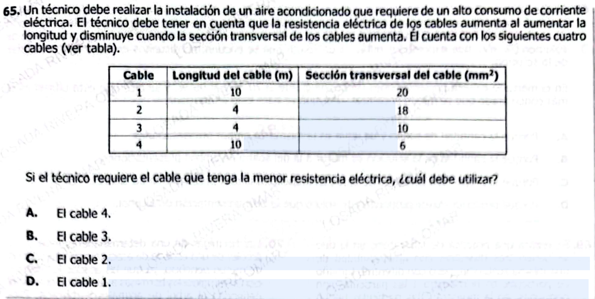

**65.** Un técnico debe realizar la instalación de un aire acondicionado que requiere de un alto consumo de corriente eléctrica. El técnico debe tener en cuenta que la resistencia eléctrica de los cables aumenta al aumentar la longitud y disminuye cuando la sección transversal de los cables aumenta. El técnico cuenta con los siguientes cuatro cables:

| Cable | Longitud del cable (m) | Sección transversal del cable (mm²) |
|--------|------------------------|--------------------------------------|
| 1      | 10                     | 20                                   |
| 2      | 4                      | 18                                   |
| 3      | 4                      | 10                                   |
| 4      | 10                     | 6                                    |

Si el técnico requiere el cable que tenga la menor resistencia eléctrica, ¿cuál debe utilizar?

A. El cable 4.  
B. El cable 3.  
C. El cable 2.  
D. El cable 1.  

Excelente — este ya es **nivel ICFES alto (razonamiento proporcional + lectura de tabla)**. Vamos completo y estructurado como pediste.

***

# ✅ 1) ¿Qué está evaluando?

### 🔍 Conceptos clave:

* **Resistencia eléctrica**
* Relación:
  * $$R \propto \text{longitud}$$
  * $$R \propto \frac{1}{\text{área}}$$

***

### 🧠 Habilidad:

* Interpretar relaciones inversas y directas
* Comparar datos en tabla
* Tomar decisiones óptimas

***

### ⚠️ Trampa ICFES:

Ver solo **una variable**:

* Elegir el más corto ❌
* Elegir el más grueso ❌

👉 Hay que **combinar ambas**

***

# ✅ Traducción matemática (clave)

$$
R \propto \frac{L}{A}
$$

Donde:

* $$L$$: longitud
* $$A$$: área (sección transversal)

***

# ✅ Datos de la tabla

| Cable | Longitud (m) | Área |
| ----- | ------------ | ---- |
| 1     | 10           | 20   |
| 2     | 4            | 18   |
| 3     | 4            | 10   |
| 4     | 10           | 6    |

***

# ✅ Cálculo comparativo

(No necesitas fórmula exacta, solo comparar $$L/A$$)

| Cable | $$L/A$$       |
| ----- | ------------- |
| 1     | 10/20 = 0.5   |
| 2     | 4/18 ≈ 0.22 ✅ |
| 3     | 4/10 = 0.4    |
| 4     | 10/6 ≈ 1.67   |

***

# ✅ Respuesta pregunta original

### ✔️ Respuesta correcta: **C (cable 2)**

***

### ✅ Explicación:

* Más corto ✅
* Más grueso ✅  
  → Menor resistencia

***

# ✅ 2) Teoría (ICFES directa)

## ⚡ Resistencia eléctrica

Depende de:

$$
R = \rho \frac{L}{A}
$$

***

## 🎯 Relaciones clave

| Variable   | Efecto en R |
| ---------- | ----------- |
| Longitud ↑ | R ↑         |
| Área ↑     | R ↓         |

***

## 🧠 Intuición

* Cable largo = más obstáculos
* Cable grueso = más espacio para corriente

***

## ✅ Ejemplos

### Ejemplo 1:

Corto + grueso → menor resistencia

### Ejemplo 2:

Largo + delgado → mayor resistencia

***

# ✅ 3) Preguntas Conceptuales

1. ¿Qué ocurre si aumenta la longitud?
2. ¿Qué ocurre si aumenta el área?
3. ¿Qué variable reduce la resistencia?
4. ¿Por qué un cable largo tiene más resistencia?
5. ¿Qué representa el área?
6. ¿Cuál es más eficiente: grueso o delgado?
7. ¿Qué ocurre si ambas variables aumentan?
8. ¿Qué relación tiene la resistencia con el área?
9. ¿Qué tipo de relación hay con la longitud?
10. ¿Qué significa sección transversal?
11. ¿Por qué se busca menor resistencia?
12. ¿Qué pasa en un cable delgado?
13. ¿Qué representa la corriente?
14. ¿Cuál combinación es peor?
15. ¿Qué afecta más: longitud o área?

***

# ✅ Respuestas Conceptuales

1. Aumenta resistencia
2. Disminuye resistencia
3. Área grande
4. Más recorrido para electrones
5. Grosor del cable
6. Grueso
7. Depende de proporción
8. Inversa
9. Directa
10. Área del corte
11. Menos pérdida de energía
12. Aumenta resistencia
13. Flujo de electrones
14. Largo y delgado
15. Depende de magnitud

***

# ✅ 4) Preguntas tipo ICFES

***

### 1.

Si la longitud aumenta:

A. R baja  
B. R sube  
C. R igual  
D. R desaparece

***

### 2.

Mayor área implica:

A. Más resistencia  
B. Menos resistencia  
C. Igual resistencia  
D. Sin cambio

***

### 3.

Un cable ideal es:

A. Largo y delgado  
B. Corto y grueso  
C. Largo y grueso  
D. Corto y delgado

***

### 4.

La resistencia depende de:

A. Color  
B. Longitud y área  
C. Tiempo  
D. Energía

***

### 5.

Un cable delgado tiene:

A. Menor resistencia  
B. Mayor resistencia  
C. Igual  
D. Ninguna

***

### 6.

Relación con área es:

A. Directa  
B. Inversa  
C. Nula  
D. Lineal

***

### 7.

Relación con longitud es:

A. Directa  
B. Inversa  
C. Nula  
D. No existe

***

### 8.

Reducir resistencia implica:

A. Aumentar longitud  
B. Reducir área  
C. Aumentar área  
D. Cambiar color

***

### 9.

Más resistencia significa:

A. Mejor paso  
B. Peor paso  
C. Igual  
D. Más energía

***

### 10.

Cable largo genera:

A. Menos oposición  
B. Más oposición  
C. Igual  
D. Menos corriente siempre

***

### 11.

Sección transversal es:

A. Largo  
B. Área  
C. Volumen  
D. Peso

***

### 12.

Cable ancho permite:

A. Menos corriente  
B. Más flujo  
C. Igual flujo  
D. Sin cambio

***

### 13.

Mejor combinación:

A. Largo y delgado  
B. Corto y grueso  
C. Largo y medio  
D. Corto y delgado

***

### 14.

Si duplicas área:

A. R aumenta  
B. R disminuye  
C. R igual  
D. R desaparece

***

### 15.

Si duplicas longitud:

A. R baja  
B. R sube  
C. R igual  
D. R cero

***

# ✅ Respuestas Preguntas ICFES

1. B
2. B
3. B
4. B
5. B
6. B
7. A
8. C
9. B
10. B
11. B
12. B
13. B
14. B
15. B

***

# 🎯 CLAVE DE ORO

> **Menor resistencia = cable corto + grueso**

***
