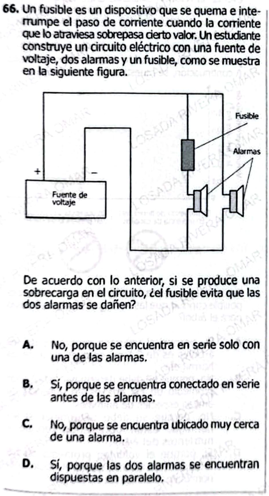

## **1. Conceptos clave examinados**

* **Fusible y protección de circuitos**
* **Circuitos eléctricos en paralelo**
* **Corriente eléctrica y sobrecarga**
* **Distribución de corriente en ramas paralelas**
* **Limitaciones de protección selectiva**

***

## **2. Resumen teórico**

### **Fusibles**

Un fusible es un dispositivo de protección que se funde (abre el circuito) cuando la corriente excede un valor seguro, interrumpiendo el paso de corriente y evitando daños a los componentes que se encuentran en la misma rama del circuito.

### **Circuitos en paralelo**

En un circuito paralelo, cada rama conecta directamente a la fuente. La corriente total se divide entre las ramas según su resistencia. Cada rama puede tener componentes distintos.

### **Protección selectiva**

El fusible solo protege la alarma que está en su misma rama; si ocurre una sobrecarga en esa rama, el fusible se funde y solo esa alarma queda protegida. La otra alarma, al estar en una rama sin fusible, queda expuesta y podría dañarse si ocurre una sobrecarga en su rama.

***

## **3. 15 preguntas conceptuales**

1. ¿Qué función cumple un fusible en un circuito eléctrico?
2. ¿Qué sucede cuando la corriente supera el valor máximo permitido por el fusible?
3. ¿Cómo afecta la presencia de un fusible en una sola rama de un circuito paralelo?
4. ¿En qué situaciones un fusible puede proteger todos los componentes del circuito?
5. ¿Qué ocurre con una alarma en la rama sin fusible ante una sobrecarga?
6. ¿Cómo se distribuye la corriente en un circuito paralelo?
7. ¿Por qué es importante colocar fusibles en cada rama de un circuito paralelo?
8. ¿Qué pasaría si el fusible se coloca en el cable común antes de la división?
9. ¿Qué sucede cuando el fusible se funde en el circuito descrito?
10. ¿La alarma sin fusible sigue funcionando si el fusible se funde?
11. ¿Qué limita la protección de un fusible instalado solo en una rama?
12. ¿Cómo podría el estudiante proteger ambas alarmas de una sobrecarga?
13. ¿Cuál es la diferencia en protección entre circuitos en serie y en paralelo?
14. ¿Qué riesgos existen si sólo una rama del circuito paralelo tiene fusible?
15. ¿La corriente total del circuito cambia si se funde el fusible de una rama?

***

## **4. 15 preguntas tipo ICFES**

1. Si ocurre una sobrecarga en la rama con fusible, ¿qué sucede?
   * A) Ambas alarmas dejan de funcionar.
   * B) Solo la alarma con fusible se apaga.
   * C) La alarma sin fusible se apaga.
   * D) El fusible protege ambas alarmas.

2. En el circuito descrito, ¿cuál alarma está protegida ante sobrecarga?
   * A) Ambas
   * B) Solo la alarma en la rama con fusible
   * C) Ninguna
   * D) Solo la alarma sin fusible

3. Si hay sobrecarga en la rama sin fusible, ¿qué ocurre?
   * A) El fusible se funde y ambas alarmas se apagan.
   * B) Solo la alarma sin fusible puede dañarse.
   * C) Ambas alarmas están protegidas.
   * D) El fusible protege ambas ramas.

4. Para proteger ambas alarmas de sobrecarga, se debe:
   * A) Colocar un fusible en cada rama.
   * B) No colocar fusibles.
   * C) Usar una fuente de mayor voltaje.
   * D) Conectar las alarmas en serie.

5. Si el fusible se funde, ¿qué ocurre con la alarma sin fusible?
   * A) Deja de funcionar.
   * B) Sigue funcionando.
   * C) Se funde.
   * D) Recibe sobrecorriente.

6. ¿Por qué la alarma sin fusible puede dañarse?
   * A) Por estar expuesta a sobrecorriente.
   * B) Porque el fusible la protege.
   * C) Por baja resistencia.
   * D) Por estar conectada en serie.

7. ¿Cómo se puede asegurar la protección de todos los componentes en un circuito paralelo?
   * A) Fusibles en cada rama.
   * B) Fusible en una sola rama.
   * C) Solo resistores.
   * D) Eliminar fusibles.

8. El fusible protege:
   * A) Todos los componentes del circuito.
   * B) Solo los de su rama.
   * C) Solo la fuente de voltaje.
   * D) Ninguno.

9. Si el fusible está solo en una rama, la corriente en la otra:
   * A) Se interrumpe al fundirse el fusible.
   * B) Continúa normalmente.
   * C) Se duplica.
   * D) Disminuye.

10. ¿Qué característica debe tener un fusible para proteger adecuadamente?
    * A) Fundirse a un valor de corriente específico.
    * B) Ser de cualquier material.
    * C) Ser muy grueso.
    * D) Tener alta resistencia.

11. ¿Qué ocurre si ambas ramas tienen fusibles y hay una sobrecarga en una?
    * A) Solo se funde el fusible de la rama afectada.
    * B) Se funden ambos fusibles.
    * C) Se dañan ambas alarmas.
    * D) No ocurre nada.

12. ¿Cuál es la mejor manera de proteger un circuito con varios componentes en paralelo?
    * A) Fusible en cada rama.
    * B) Fusible solo en la rama más importante.
    * C) No usar fusibles.
    * D) Usar resistores.

13. La función del fusible en el circuito es:
    * A) Interrumpir la corriente ante sobrecarga en su rama.
    * B) Regular el voltaje.
    * C) Generar calor.
    * D) Permitir mayor corriente.

14. ¿Qué tipo de circuito se describe cuando cada componente tiene su propia protección?
    * A) Serie
    * B) Paralelo con fusibles por rama
    * C) Circuito mixto
    * D) Paralelo sin protección

15. Si el fusible está en la rama con alarma 1, ¿qué sucede si hay sobrecarga en la rama con alarma 2?
    * A) El fusible no se funde y alarma 2 puede dañarse.
    * B) Se funde el fusible y ambas alarmas se apagan.
    * C) Ambas alarmas están protegidas.
    * D) La fuente de voltaje se apaga.

***

# **Respuestas Explicadas**

### **Conceptuales**

1. Protege un componente o rama contra sobrecorriente.
2. Se funde y abre el circuito, interrumpiendo el paso de corriente.
3. Solo protege la alarma en esa rama; la otra queda desprotegida.
4. Cuando está antes de la división a todas las ramas.
5. Puede dañarse si recibe una sobrecorriente.
6. La corriente se divide entre ramas paralelas.
7. Para proteger todos los componentes, cada rama debe tener fusible.
8. Protege todas las alarmas si está antes de la división.
9. La alarma en la rama del fusible se apaga, la otra sigue funcionando.
10. Sí, sigue funcionando si el fusible de la otra rama se funde.
11. Solo protege la rama donde está instalado.
12. Colocando un fusible en cada rama.
13. En serie, un fusible protege todo el circuito; en paralelo, solo la rama.
14. Componentes en ramas sin fusible quedan expuestos a sobrecorriente.
15. Disminuye la corriente total, pero la otra rama sigue funcionando.

***

### **Tipo ICFES**

1. B
2. B
3. B
4. A
5. B
6. A
7. A
8. B
9. B
10. A
11. A
12. A
13. A
14. B
15. A

***

¿Quieres continuar con otra pregunta ICFES o necesitas más material sobre este tema?
