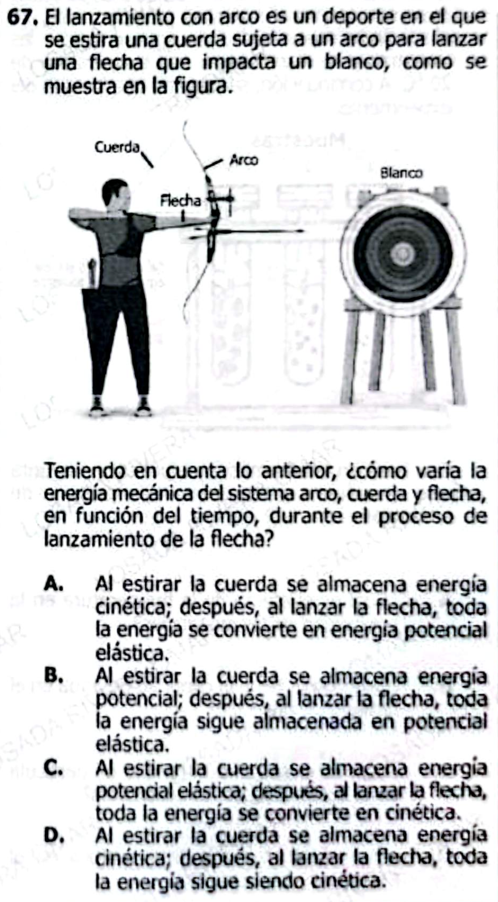

¡Perfecto! Aquí tienes el análisis solicitado basado en la pregunta de ICFES sobre el lanzamiento con arco:

***

## 1. **Conceptos clave que examina la pregunta:**

* **Energía mecánica**
* **Energía potencial elástica**
* **Energía cinética**
* **Transformación y conservación de la energía**
* **Sistemas físicos (arco, cuerda, flecha)**
* **Transferencia de energía**

***

## 2. **Resumen teórico de los conceptos**

### **Energía mecánica**

La energía mecánica de un sistema es la suma de la energía cinética (movimiento) y la energía potencial (posición o configuración). Se expresa como:

$$
E_{\text{mecánica}} = E_{\text{cinética}} + E_{\text{potencial}} 
$$

### **Energía potencial elástica**

Es la energía almacenada en un objeto elástico, como la cuerda del arco, cuando se estira o comprime:

$$
E_{\text{potencial elástica}} = \frac{1}{2} k x^2 
$$

Donde $$k$$ es la constante elástica y $$x$$ es el estiramiento.

### **Energía cinética**

Es la energía asociada al movimiento de un cuerpo:

$$
E_{\text{cinética}} = \frac{1}{2} m v^2 
$$

### **Transformación y conservación de la energía**

En sistemas ideales (sin fricción ni pérdidas), la energía mecánica total se conserva. En el proceso del lanzamiento:

* Al estirar la cuerda, se acumula energía potencial elástica.
* Al soltar la cuerda, la energía potencial se transforma en energía cinética de la flecha.
* En la vida real, parte de la energía se disipa como calor y sonido, pero en la pregunta se asume idealmente la conservación.

### **Transferencia de energía**

La energía “viaja” del arco y la cuerda hacia la flecha, primero como potencial elástica y luego como cinética.

### **Evolución durante el tiempo**

* **Inicial:** Energía mecánica almacenada como potencial elástica.
* **Durante el disparo:** Se convierte gradualmente en energía cinética de la flecha.
* **Después del disparo:** La mayoría de la energía está como energía cinética de la flecha en movimiento.

***

¡Gracias por tu aclaración! Aquí tienes el material ajustado:  
Las **respuestas explicadas están al final**, separadas de las preguntas.

***

## **15 Preguntas Conceptuales**

1. ¿Qué es la energía mecánica?
2. ¿Qué tipo de energía se almacena al estirar la cuerda de un arco?
3. ¿Qué sucede con la energía potencial elástica al soltar la flecha?
4. ¿La energía mecánica total cambia durante el proceso en condiciones ideales?
5. ¿Qué tipo de energía tiene la flecha al salir disparada?
6. Da un ejemplo cotidiano de energía potencial elástica.
7. ¿La energía cinética depende de la masa?
8. ¿Qué ocurre si hay rozamiento entre la flecha y el aire?
9. ¿Por qué la energía potencial disminuye mientras la flecha acelera?
10. En el instante previo al disparo, ¿qué forma de energía predomina?
11. Cuando la flecha está en reposo, ¿tiene energía cinética?
12. ¿Qué es la energía potencial?
13. ¿El sistema arco-flecha-cuerda se considera abierto o cerrado en condiciones ideales?
14. ¿Qué función cumple el arco en el sistema energético?
15. ¿Qué factor determina cuánta energía recibe la flecha?

***

## **15 Preguntas Tipo ICFES**

1. ¿Qué tipo de energía es máxima justo antes de soltar la flecha?
   * A) Cinética
   * B) Potencial elástica
   * C) Térmica
   * D) Química

2. Cuando la flecha se encuentra en el aire, ¿qué energía predomina?
   * A) Potencial gravitacional
   * B) Cinética
   * C) Potencial elástica
   * D) Térmica

3. Si el arco es menos flexible, ¿qué sucede con la energía potencial elástica máxima?
   * A) Disminuye
   * B) Aumenta
   * C) Se mantiene
   * D) Se vuelve cinética

4. Si parte de la energía no se transfiere a la flecha, ¿en qué se convierte principalmente?
   * A) Energía química
   * B) Calor y sonido
   * C) Energía eléctrica
   * D) Potencial gravitacional

5. ¿Cuál es el principal proceso energético al lanzar la flecha?
   * A) Potencial a cinética
   * B) Cinética a potencial
   * C) Química a térmica
   * D) Térmica a eléctrica

6. ¿Qué ocurre con la energía mecánica si no hay pérdidas externas?
   * A) Disminuye
   * B) Aumenta
   * C) Se conserva
   * D) Se transforma en calor

7. ¿Cómo influye la masa de la flecha en su energía cinética final?
   * A) No influye
   * B) A mayor masa, mayor energía cinética
   * C) A menor masa, mayor energía cinética (a igual velocidad)
   * D) Solo depende del arco

8. ¿Qué representa la energía potencial elástica almacenada?
   * A) Trabajo que puede realizar la cuerda
   * B) Calor acumulado
   * C) Energía cinética inmediata
   * D) Energía gravitacional

9. ¿En qué punto del lanzamiento la velocidad de la flecha es mayor?
   * A) Antes de soltar la cuerda
   * B) Justo después de soltar la cuerda
   * C) A mitad de trayectoria
   * D) Al golpear el blanco

10. Si la cuerda se rompe al estirarse, ¿qué ocurre con la energía acumulada?
    * A) Se disipa en calor y sonido
    * B) Se transfiere a la flecha
    * C) Permanece en la cuerda
    * D) Se convierte en energía química

11. ¿Qué sucede con la energía si se dispara la flecha hacia arriba?
    * A) Se transforma gradualmente en potencial gravitacional
    * B) Permanece solo como cinética
    * C) Se transforma en eléctrica
    * D) Desaparece

12. Si se usa una flecha más pesada, ¿cómo cambia su velocidad si la energía potencial es la misma?
    * A) Aumenta
    * B) Disminuye
    * C) No varía
    * D) Solo depende de la cuerda

13. ¿Cuál de los siguientes es un ejemplo de energía potencial elástica?
    * A) Agua en una represa
    * B) Batería cargada
    * C) Resorte comprimido
    * D) Planeta en órbita

14. El principio que explica la conversión de energía en el sistema arco-flecha es:
    * A) Ley de la inercia
    * B) Conservación de la energía
    * C) Principio de Pascal
    * D) Ley de gravitación universal

15. Al soltar la cuerda, la aceleración de la flecha depende principalmente de:
    * A) Fuerza elástica de la cuerda
    * B) Gravedad
    * C) Temperatura ambiente
    * D) Fricción con el aire

***

# **Respuestas Explicadas**

### **Preguntas Conceptuales**

1. Es la suma de la energía cinética y potencial de un sistema.
2. Energía potencial elástica.
3. Se transforma en energía cinética de la flecha.
4. No, se conserva en condiciones ideales.
5. Energía cinética.
6. Un resorte comprimido o una liga estirada.
7. Sí, la energía cinética depende de la masa y el cuadrado de la velocidad.
8. Parte de la energía se transforma en calor, disminuyendo la energía mecánica de la flecha.
9. Porque se convierte en energía cinética (movimiento de la flecha).
10. Energía potencial elástica.
11. No, su energía cinética es cero mientras está en reposo.
12. Es la energía asociada a la posición o estado de deformación.
13. Cerrado, si se asume sin pérdidas.
14. Almacena y transfiere energía a la flecha mediante la cuerda.
15. La cantidad de energía acumulada en la cuerda (potencial elástica) y la eficiencia de transferencia.

***

### **Preguntas Tipo ICFES**

1. B) Potencial elástica
2. B) Cinética
3. A) Disminuye
4. B) Calor y sonido
5. A) Potencial a cinética
6. C) Se conserva
7. B) A mayor masa, mayor energía cinética (a igual velocidad)
8. A) Trabajo que puede realizar la cuerda
9. B) Justo después de soltar la cuerda
10. A) Se disipa en calor y sonido
11. A) Se transforma gradualmente en potencial gravitacional
12. B) Disminuye
13. C) Resorte comprimido
14. B) Conservación de la energía
15. A) Fuerza elástica de la cuerda

***

