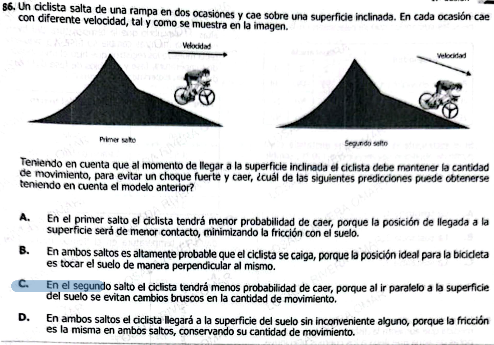

Perfecto — retomamos el proceso.



***

# 🔍 **1. Clasificación**

* **Área:** Física
* **Subcampo:** **Dinámica (mecánica)** con componente de:
  * **Cantidad de movimiento (momento lineal)**
  * **Impulso**
  * **Colisiones / cambios de dirección**

***

# 🧠 **2. Extracción de conceptos**

### ⚙️ **Conceptos principales**

* **Cantidad de movimiento (p = m·v)**
* **Cambio de momento (Δp)**
* **Impulso (F·Δt)**
* **Dirección del movimiento**
* **Choque vs transición suave**

***

### 🔗 **Concepto clave del ítem**

> No es solo la velocidad — es **cómo cambia la dirección del movimiento al impactar la superficie**.

***

# 🎯 **Qué está evaluando realmente**

El enunciado dice:

> “mantener la cantidad de movimiento para evitar un choque fuerte”

👉 Traducción física:

```
Menor cambio en dirección/velocidad → menor fuerza → menos riesgo de caída
Mayor cambio → mayor fuerza → mayor impacto
```

***

# ⚠️ **Análisis conceptual de cada opción**

***

### **A.**

“Menor contacto → menos fricción”

❌ **Incorrecta**

* El problema NO es fricción
* Es cambio de momento
* Además, menos contacto no significa menor impacto

👉 Trampa: mencionar fricción fuera de contexto

***

### **B.**

“Tocar perpendicularmente es ideal”

❌ **Incorrecta**

* Perpendicular → cambio BRUSCO de dirección
* → mayor fuerza
* → más riesgo de caída

👉 Trampa fuerte: suena lógico pero es físicamente incorrecto

***

### **C.**

“Paralelo → evita cambios bruscos en cantidad de movimiento”

✅ **Correcta**

* Si aterriza **alineado con la superficie**:
  * la dirección del movimiento cambia poco
  * el impacto es más suave

👉 Este es el concepto central del problema

***

### **D.**

“Fricción es la misma → no hay problema”

❌ **Incorrecta**

* La fricción no es el factor determinante aquí
* Ignora completamente el cambio de momento

***

# ✅ **Conclusión conceptual (nivel examen)**

```
Impacto fuerte = gran cambio de velocidad/dirección
Impacto suave = cambio gradual o alineado
```

***

# 🧠 **Idea central que debes internalizar**

```
No importa solo qué tan rápido vas,
importa cómo cambias tu movimiento al aterrizar.
```

***

# ⚡ **Regla rápida para este tipo de preguntas**

> Si el movimiento es **paralelo o gradual → seguro**  
> Si es **perpendicular o brusco → peligroso**

***


Perfecto — te dejo un **resumen teórico claro + práctico**, sin relleno, y con **2–3 preguntas bien diseñadas para entrenar**.

***

# 🧠 **Resumen teórico: Vectores en física**

***

## 🔹 1. ¿Qué es un vector?

Un **vector** es una cantidad que tiene:

* ✅ **Magnitud** → cuánto vale (ej: 10 m/s)
* ✅ **Dirección** → hacia dónde apunta
* ✅ **Sentido** → orientación (ej: izquierda o derecha)

📌 Ejemplos en física:

* Velocidad
* Fuerza
* Cantidad de movimiento

***

## 🔹 2. Escalar vs vector

| Tipo    | Tiene dirección | Ejemplo           |
| ------- | --------------- | ----------------- |
| Escalar | ❌               | masa, temperatura |
| Vector  | ✅               | fuerza, velocidad |

***

## 🔹 3. Composición de vectores (suma)

👉 Es **combinar vectores en uno solo equivalente**

### 📌 Idea clave:

> Dos movimientos simultáneos → un solo movimiento resultante

### 🔧 Método conceptual:

* Si apuntan igual → se suman
* Si opuestos → se restan
* Si en ángulo → se combinan (diagonal)

📌 Ejemplo:
Un objeto va:

* 3 m/s hacia el este
* 4 m/s hacia el norte

→ Resultado: **movimiento diagonal**

***

## 🔹 4. Descomposición de vectores

👉 Es lo contrario: separar un vector en partes

### 📌 Idea clave:

> Un movimiento diagonal = dos movimientos independientes

### Componentes típicos:

* Horizontal (x)
* Vertical (y)

📌 Ejemplo:
Un ciclista baja en diagonal → puedes separar:

* velocidad horizontal
* velocidad vertical

***

## 🔥 5. Aplicación en física

### ✅ Movimiento

* Trayectorias inclinadas
* proyectiles

***

### ✅ Fuerzas

* fuerza en plano inclinado
* tensión en cuerdas

***

### ✅ Cantidad de movimiento

* dirección afecta el impacto
* cambio de dirección = cambio de momento

***

## 🧠 **Frase clave (ICFES)**

```
Un vector no es solo cuánto,
es cuánto y hacia dónde.
```

***

# 🧪 **Preguntas de práctica**

***

### **1.**

Un objeto se mueve con velocidad constante pero cambia de dirección. ¿Qué ocurre?

A. Su vector velocidad no cambia  
B. Solo cambia la magnitud  
C. Cambia el vector aunque la rapidez sea la misma  
D. No hay cambio físico

✅ **Respuesta: C**  
👉 Porque la dirección es parte del vector.

***

### **2.**

Un movimiento diagonal puede interpretarse como:

A. Un solo movimiento simple  
B. Dos movimientos independientes en direcciones diferentes  
C. Un movimiento escalar  
D. Un cambio de masa

✅ **Respuesta: B**  
👉 Eso es descomposición de vectores.

***

### **3.**

Dos vectores apuntan en direcciones opuestas. Al sumarlos:

A. Siempre aumentan  
B. Se cancelan parcialmente  
C. No cambian  
D. Se vuelven escalares

✅ **Respuesta: B**  
👉 Se restan en magnitud.

***

# 🎯 **Qué debes dominar**

* Un vector tiene **dirección (clave en ICFES)**
* Cambiar dirección = cambiar el vector
* Composición → combinar movimientos
* Descomposición → entender movimientos complejos

***

Perfecto — ahora vamos al nivel que realmente mejora tu rendimiento:  
👉 **visualización mental de vectores (como lo hace ICFES)**

***

# 🧠 **Cómo pensar vectores sin dibujo (clave para examen)**

## 🔹 Regla mental 1

```
→ derecha (+)
← izquierda (−)
↑ arriba (+)
↓ abajo (−)
```

***

## 🔹 Regla mental 2 (composición)

* En la **misma dirección → se suman**
* En **dirección opuesta → se restan**
* En **direcciones diferentes → forman diagonal**

***

## 🔹 Regla mental 3 (descomposición)

Un vector inclinado se puede ver como:

```
diagonal = horizontal + vertical
```

***

# 🧪 **Ejercicios tipo ICFES (visualización mental)**

***

## **1.**

Un objeto tiene dos movimientos simultáneos:

* 5 m hacia la derecha
* 5 m hacia arriba

El resultado es un movimiento:

A. Horizontal  
B. Vertical  
C. En diagonal  
D. Nulo

✅ **Respuesta: C**

**Cómo pensarlo:**
→ y ↑ → generan una diagonal  
👉 No se cancelan porque no son opuestos

***

## **2.**

Un objeto se mueve:

* 10 m hacia la derecha
* 6 m hacia la izquierda

El resultado es:

A. 16 m hacia la derecha  
B. 4 m hacia la derecha  
C. 4 m hacia la izquierda  
D. 16 m hacia la izquierda

✅ **Respuesta: B**

**Cómo pensarlo:**
→ 10 − 6 = 4 → queda hacia la derecha

👉 Esto es composición en línea recta

***

## **3.**

Un vector apunta en diagonal hacia arriba y la derecha. ¿Cuál es su descomposición?

A. Solo horizontal  
B. Solo vertical  
C. Una componente horizontal y otra vertical  
D. No se puede descomponer

✅ **Respuesta: C**

***

## **4.**

Dos vectores tienen igual magnitud:

* Uno hacia arriba
* Otro hacia abajo

El resultado es:

A. Se suman  
B. Se cancelan  
C. Forman diagonal  
D. Aumentan

✅ **Respuesta: B**

👉 Son opuestos → resultado cero

***

## **5.**

Un ciclista baja una rampa inclinada. Su velocidad:

A. Solo horizontal  
B. Solo vertical  
C. Se puede descomponer en horizontal y vertical  
D. No tiene dirección

✅ **Respuesta: C**

👉 Esto conecta directamente con física real (como tu pregunta anterior)

***

## **6. (nivel más alto)**

Un objeto tiene velocidad constante en magnitud, pero cambia de dirección de este a norte. Entonces:

A. No cambia el vector  
B. Disminuye la magnitud  
C. Cambia el vector completamente  
D. Se anula

✅ **Respuesta: C**

👉 Este es el concepto CLAVE que conecta con cantidad de movimiento

***

## **7. (tipo trampa)**

Un objeto tiene dos vectores:

* 4 unidades hacia la derecha
* 3 unidades hacia arriba

¿Cuál afirmación es correcta?

A. El resultado es 7 unidades  
B. El resultado es menor que 7  
C. El resultado es 1  
D. No hay resultado

✅ **Respuesta: B**

👉 Porque no se suman directamente  
→ forman diagonal (Teorema de Pitágoras implícito)

***

# 🧠 **INSIGHT QUE DEBES RECORDAR**

```
Direcciones iguales → sumas
Direcciones opuestas → restas
Direcciones diferentes → diagonal
```

***

# 🔥 **Conexión con física real**

Esto es EXACTAMENTE lo que pasa en:

* 🚲 el ciclista (dirección del aterrizaje)
* 💥 choques (cambio de vector)
* 🪂 caídas y trayectorias

***

# ⚡ **Truco de examen (muy útil)**

Si ves:

* dos direcciones diferentes → piensa **diagonal**
* direcciones opuestas → piensa **resta**
* cambio de dirección → piensa **cambio de vector → fuerza**

***


Perfecto — ahora sí vamos a hacerlo **bien enfocado en lo que realmente necesitas dominar**:  
👉 **vectores + cantidad de movimiento (momento lineal) + dirección + magnitud**

Sin ruido.

***

# 🧠 **TEORÍA CLAVE (nivel alto, directo)**

***

## 🚀 1. **Cantidad de movimiento (momento lineal)**

$$
\vec{p} = m \cdot \vec{v}
$$

* Es un **vector**
* Tiene:
  * ✅ **magnitud** → $$p = m \cdot v$$
  * ✅ **dirección** → la misma de la velocidad

***

## 🎯 2. **Lo más importante (esto define el problema)**

> **Cambiar la dirección del movimiento = cambiar la cantidad de movimiento**

***

## ⚡ 3. **Cambio de cantidad de movimiento**

$$
\Delta \vec{p} = \vec{p}_{final} - \vec{p}_{inicial}
$$

* Si cambia la velocidad → cambia $$\vec{p}$$
* Si cambia la dirección → también cambia $$\vec{p}$$

***

## 🔥 4. **Impacto (lo que el problema quiere)**

$$
\vec{F} \cdot \Delta t = \Delta \vec{p}
$$

👉 Traducción clara:

* **Mayor cambio de momento → mayor fuerza**
* **Cambio brusco → impacto fuerte**

***

## 🧭 5. **Paralelo vs perpendicular**

### ✅ Movimiento paralelo a la superficie

* Dirección ≈ igual
* $$\Delta p$$ pequeño  
  → impacto suave

***

### ❌ Movimiento perpendicular

* Dirección cambia mucho
* $$\Delta p$$ grande  
  → impacto fuerte

***

## 🧠 **Idea central (grábate esto)**

```
No importa solo la rapidez,
importa CUÁNTO cambia el vector velocidad.
```

***

# 🧪 **Preguntas tipo ICFES (vectores y momento)**

***

### **1.**

La cantidad de movimiento de un cuerpo depende de:

A. Solo la rapidez  
B. Solo la masa  
C. La masa y la dirección de la velocidad  
D. Solo la dirección

***

### **2.**

Si un objeto mantiene su rapidez pero cambia de dirección, su cantidad de movimiento:

A. Permanece igual  
B. Disminuye  
C. Aumenta  
D. Cambia

***

### **3.**

Un impacto fuerte ocurre cuando:

A. La masa es pequeña  
B. La rapidez es constante  
C. Hay un gran cambio en la dirección del movimiento  
D. No hay fuerza

***

### **4.**

Dos objetos tienen igual masa y rapidez, pero direcciones opuestas. ¿Qué se puede afirmar?

A. Tienen igual cantidad de movimiento  
B. Tienen diferente magnitud pero misma dirección  
C. Tienen igual magnitud pero distinta dirección  
D. No tienen cantidad de movimiento

***

### **5.**

El cambio en la cantidad de movimiento depende de:

A. Solo la masa  
B. Solo la rapidez  
C. La variación del vector velocidad  
D. El tiempo únicamente

***

### **6.**

Un ciclista aterriza paralelo a una superficie inclinada. Esto implica que:

A. Su rapidez aumenta  
B. No hay cambio de movimiento  
C. El cambio de dirección es menor  
D. La masa cambia

***

### **7.**

Un cambio perpendicular del movimiento implica:

A. Cambio pequeño de momento  
B. Cambio grande de momento  
C. No hay cambio  
D. Solo cambia la masa

***

### **8.**

Si el vector velocidad inicial y final son muy diferentes, entonces:

A. El cambio de momento es pequeño  
B. No hay fuerza  
C. El cambio de momento es grande  
D. La masa disminuye

***

### **9.**

La magnitud de la cantidad de movimiento aumenta cuando:

A. Disminuye la masa  
B. Disminuye la velocidad  
C. Aumenta la velocidad  
D. Cambia la dirección

***

### **10.**

Un objeto que impacta perpendicular a una superficie experimenta:

A. Poca fuerza  
B. Ningún cambio de movimiento  
C. Gran cambio en la cantidad de movimiento  
D. Disminución de masa

***

### **11.**

El vector cantidad de movimiento siempre tiene la misma dirección que:

A. La fuerza  
B. La posición  
C. La velocidad  
D. La masa

***

### **12.**

Si un objeto cambia su dirección gradualmente en vez de bruscamente:

A. El cambio de momento es mayor  
B. El cambio de momento es menor  
C. No hay cambio  
D. La masa cambia

***

### **13.**

Dos vectores de velocidad con igual magnitud pero diferente dirección producen:

A. Igual cantidad de movimiento en todo sentido  
B. Diferente cantidad de movimiento vectorial  
C. Menor energía  
D. Igual cambio siempre

***

### **14.**

El impacto puede disminuirse si:

A. Se aumenta la masa  
B. Se reduce el cambio de dirección  
C. Se aumenta la velocidad  
D. Se elimina la fricción

***

### **15.**

El concepto más importante para analizar el aterrizaje del ciclista es:

A. Energía térmica  
B. Cantidad de movimiento vectorial  
C. Presión  
D. Densidad

***

# ✅ **RESPUESTAS**

1. C
2. D
3. C
4. C
5. C
6. C
7. B
8. C
9. C
10. C
11. C
12. B
13. B
14. B
15. B

***

# 🧠 **LO QUE QUIERO QUE TE LLEVES**

```
Momento = vector
Vector cambia → impacto

Dirección importa tanto como la rapidez.
```

***
