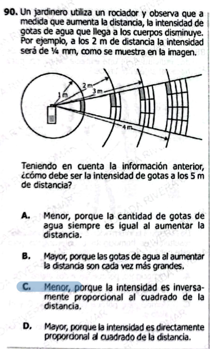

**90.** Un jardinero utiliza un rociador y observa que a medida que aumenta la distancia, la intensidad de gotas de agua que llega a los cuerpos disminuye. Por ejemplo, a los 2 m de distancia la intensidad será de ¼ mm, como se muestra en la imagen.

Teniendo en cuenta la información anterior, ¿cómo debe ser la intensidad de gotas a los 5 m de distancia?

---

### Opción A
Menor, porque la cantidad de gotas de agua siempre es igual al aumentar la distancia.  

### Opción B
Mayor, porque las gotas de agua al aumentar la distancia son cada vez más grandes.  

### Opción C
Menor, porque la intensidad es inversamente proporcional al cuadrado de la distancia.  

### Opción D
Mayor, porque la intensidad es directamente proporcional al cuadrado de la distancia.  

Excelente — esta es **ICFES nivel alto (física + proporcionalidad + interpretación geométrica)**. Vamos completo con tu formato.

***

# ✅ 1) ¿Qué está evaluando?

### 🔍 Conceptos clave:

* **Intensidad vs distancia**
* **Ley del inverso del cuadrado**
* Distribución espacial (geometría de expansión)

***

### 🧠 Habilidad:

* Identificar patrones de cambio
* Interpretar relación matemática implícita
* Generalizar a nuevas distancias

***

### ⚠️ Trampa ICFES:

Confundir:

* Disminución lineal ❌
* Tamaño de gotas ❌

👉 Aquí es una **ley cuadrática**, no lineal

***

# ✅ Información clave (del enunciado)

* A 2 m → intensidad = **¼**

Esto sugiere:

$$
I \propto \frac{1}{d^2}
$$

***

# ✅ Respuesta pregunta original

### ✔️ Respuesta correcta: **C**

***

### ✅ Explicación:

Si:

$$
I \propto \frac{1}{d^2}
$$

Entonces:

* A mayor distancia → menor intensidad
* Y la caída es **cuadrática**, no lineal

👉 A 5 m será mucho menor que a 2 m

***

### ❌ Opciones incorrectas:

* **A:** dice que cantidad es igual ❌ falso
* **B:** habla de tamaño ❌ irrelevante
* **D:** dice que aumenta ❌ totalmente falso

***

# ✅ 2) Teoría (ICFES directa)

## 🌊 Ley del inverso del cuadrado

$$
I \propto \frac{1}{d^2}
$$

***

## 🎯 Interpretación

| Distancia | Intensidad |
| --------- | ---------- |
| x         | 1          |
| 2x        | 1/4        |
| 3x        | 1/9        |

***

## 🧠 Intuición

* La energía se distribuye en área creciente
* Área ∝ $$d^2$$

👉 Por eso intensidad ↓ rápidamente

***

## ✅ Ejemplos

### Ejemplo 1:

Duplicar distancia → intensidad ÷ 4

***

### Ejemplo 2:

Triplicar distancia → intensidad ÷ 9

***

### Ejemplo 3:

Más lejos → menos energía por área

***

# ✅ 3) Preguntas Conceptuales

1. ¿Qué ocurre con la intensidad al aumentar distancia?
2. ¿Qué tipo de relación existe?
3. ¿Qué significa inverso del cuadrado?
4. ¿Por qué disminuye la intensidad?
5. ¿Qué ocurre si se duplica la distancia?
6. ¿Qué pasa si se triplica?
7. ¿La caída es lineal?
8. ¿Qué representa la intensidad?
9. ¿Qué pasa con el área al aumentar distancia?
10. ¿Qué ocurre con la energía total?
11. ¿Qué distribuye el rociador?
12. ¿Por qué las gotas parecen menos intensas?
13. ¿Qué variable controla la caída?
14. ¿Qué fenómeno es similar?
15. ¿Qué pasa si se reduce la distancia?

***

# ✅ Respuestas Conceptuales

1. Disminuye
2. Inversa cuadrática
3. 1/d²
4. Se dispersa
5. Se divide entre 4
6. Se divide entre 9
7. No
8. Cantidad por área
9. Aumenta
10. Se conserva
11. Agua
12. Se distribuyen
13. Distancia
14. Luz, sonido
15. Aumenta

***

# ✅ 4) Preguntas tipo ICFES

***

### 1.

Si aumenta la distancia, la intensidad:

A. Aumenta  
B. Permanece  
C. Disminuye  
D. Desaparece

***

### 2.

Relación entre intensidad y distancia es:

A. Directa  
B. Lineal  
C. Inversa cuadrática  
D. Exponencial

***

### 3.

Duplicar distancia implica:

A. Doble intensidad  
B. Mitad  
C. Cuarta parte  
D. Igual

***

### 4.

Triplicar distancia produce:

A. 1/3  
B. 1/6  
C. 1/9  
D. 1/12

***

### 5.

La intensidad depende de:

A. Tiempo  
B. Distancia  
C. Color  
D. Forma

***

### 6.

Mayor distancia produce:

A. Mayor intensidad  
B. Menor intensidad  
C. Igual  
D. Oscilación

***

### 7.

La ley es:

A. Lineal  
B. Cuadrática inversa  
C. Exponencial  
D. Constante

***

### 8.

La energía total:

A. Desaparece  
B. Se conserva  
C. Aumenta  
D. Disminuye

***

### 9.

La intensidad representa:

A. Energía total  
B. Energía por área  
C. Tiempo  
D. Distancia

***

### 10.

Al reducir distancia:

A. Baja intensidad  
B. Subida intensidad  
C. Igual  
D. Cero

***

### 11.

El fenómeno es similar a:

A. Temperatura  
B. Luz  
C. Masa  
D. Tiempo

***

### 12.

El área crece con:

A. d  
B. d²  
C. d³  
D. 1/d

***

### 13.

Más distancia implica:

A. Menos concentración  
B. Más concentración  
C. Igual  
D. Ninguna

***

### 14.

La intensidad disminuye porque:

A. Se pierde  
B. Se dispersa  
C. Se absorbe  
D. Se crea

***

### 15.

Ley clave es:

A. Directa  
B. Inversa  
C. Inversa cuadrática  
D. Lineal

***

# ✅ Respuestas Preguntas ICFES

1. C
2. C
3. C
4. C
5. B
6. B
7. B
8. B
9. B
10. B
11. B
12. B
13. A
14. B
15. C

***

# 🎯 CLAVE DE ORO

> **Duplicar distancia = dividir intensidad entre 4**

***
