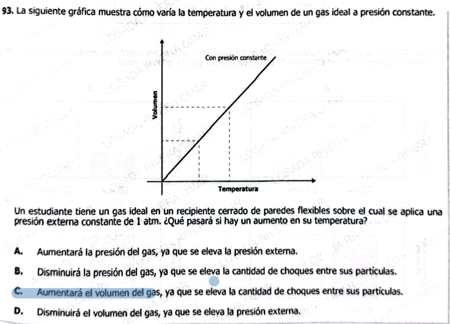

**93.** La siguiente gráfica muestra cómo varía la temperatura y el volumen de un gas ideal a presión constante.

---

### Interpretación de la gráfica
- Eje horizontal: **Temperatura**  
- Eje vertical: **Volumen**  
- Relación observada: el volumen **aumenta linealmente** con la temperatura cuando la presión es constante (ley de Charles).  

---

Un estudiante tiene un gas ideal en un recipiente cerrado de paredes flexibles sobre el cual se aplica una presión externa constante de 1 atm. ¿Qué pasará si hay un aumento en su temperatura?

---

### Opción A
Aumentará la presión del gas, ya que se eleva la presión externa.  

### Opción B
Disminuirá la presión del gas, ya que se eleva la cantidad de choques entre sus partículas.  

### Opción C
Aumentará el volumen del gas, ya que se eleva la cantidad de choques entre sus partículas.  

### Opción D
Disminuirá el volumen del gas,

Excelente — esta es **nivel ICFES alto** porque combina:

* lectura de gráfica
* modelo físico (gas ideal)
* interpretación conceptual

Vamos completo como pediste 👇

***

# ✅ 1) ¿Qué está evaluando?

### 🔍 Conceptos clave:

* **Ley de Charles**
* Relación:

$$
V \propto T \quad (\text{a presión constante})
$$

***

### 🧠 Habilidad:

* Interpretar gráfica lineal
* Conectar gráfica con fenómeno físico
* Entender sistemas a **presión constante**

***

### ⚠️ Trampa ICFES:

Confundir:

* presión cambia ❌
* volumen cambia ❌

👉 Aquí la presión **NO cambia** (el recipiente es flexible)

***

# ✅ Lectura de la gráfica (muy importante)

* Eje x → Temperatura
* Eje y → Volumen
* Línea recta creciente

👉 Significa:
✔️ A mayor temperatura → mayor volumen

***

# ✅ Respuesta pregunta original

### ✔️ Respuesta correcta: **C**

***

### ✅ Explicación:

El gas:

* Tiene **presión constante (1 atm)**
* El recipiente es **flexible**

👉 Entonces, si la temperatura aumenta:

* Las partículas → se mueven más rápido
* Hay más choques
* El sistema **se expande**

✅ → aumenta el volumen

***

### ❌ Por qué las otras están mal:

* **A:** presión no cambia ❌
* **B:** más choques no disminuyen presión ❌
* **D:** volumen no disminuye ❌

***

# ✅ 2) Teoría (ICFES directa)

## 🔥 Ley de Charles

$$
V = kT
$$

(a presión constante)

***

## 🎯 Interpretación

| Temperatura ↑ | Volumen ↑ |
| ------------- | --------- |

***

## 🧠 Intuición física

* Más temperatura = partículas más rápidas
* Más choques contra las paredes
* El gas necesita más espacio

***

## ✅ Ejemplos

### Ejemplo 1:

Gas calentado → se expande

### Ejemplo 2:

Gas enfriado → se contrae

### Ejemplo 3:

Globo caliente → crece

***

# ✅ 3) Preguntas Conceptuales

1. ¿Qué ocurre si aumenta la temperatura?
2. ¿Qué variable permanece constante?
3. ¿Qué representa la gráfica?
4. ¿Qué tipo de relación hay?
5. ¿Por qué aumenta el volumen?
6. ¿Qué pasa con las partículas?
7. ¿Qué ocurre si baja la temperatura?
8. ¿Qué es la ley de Charles?
9. ¿Qué representa la pendiente?
10. ¿Qué pasa si el recipiente es rígido?
11. ¿Qué ocurre con la presión en este caso?
12. ¿Qué significa proporcionalidad directa?
13. ¿Qué aumenta con temperatura?
14. ¿Por qué el gas se expande?
15. ¿Qué controla el volumen?

***

# ✅ Respuestas Conceptuales

1. Aumenta volumen
2. Presión
3. Volumen vs temperatura
4. Directa
5. Mayor movimiento
6. Se mueven más rápido
7. Disminuye volumen
8. V ∝ T
9. Constante de proporcionalidad
10. Cambiaría presión
11. Permanece constante
12. Ambas suben juntas
13. Energía cinética
14. Más choques
15. Temperatura

***

# ✅ 4) Preguntas tipo ICFES

***

### 1.

Si aumenta la temperatura:

A. Volumen baja  
B. Volumen sube  
C. Presión cambia  
D. Nada pasa

***

### 2.

La relación es:

A. Inversa  
B. Directa  
C. Exponencial  
D. Constante

***

### 3.

La ley aplicada es:

A. Boyle  
B. Charles  
C. Ohm  
D. Newton

***

### 4.

A presión constante:

A. V ∝ T  
B. V ∝ 1/T  
C. V constante  
D. T constante

***

### 5.

Si T baja:

A. V sube  
B. V baja  
C. V igual  
D. V desaparece

***

### 6.

La pendiente indica:

A. Cambio  
B. Relación  
C. Constante  
D. Error

***

### 7.

Las partículas al calentarse:

A. Se detienen  
B. Aumentan velocidad  
C. Desaparecen  
D. Cambian masa

***

### 8.

Mayor temperatura implica:

A. Menos choques  
B. Más choques  
C. Igual  
D. Ninguno

***

### 9.

El recipiente es:

A. Rígido  
B. Flexible  
C. Abierto  
D. Cerrado rígido

***

### 10.

La presión:

A. Aumenta  
B. Disminuye  
C. Constante  
D. Desaparece

***

### 11.

Si el recipiente fuera rígido:

A. Cambia volumen  
B. Cambia presión  
C. Nada cambia  
D. Desaparece gas

***

### 12.

La gráfica es:

A. Decreciente  
B. Constante  
C. Creciente  
D. Curva

***

### 13.

Más energía implica:

A. Menos movimiento  
B. Más movimiento  
C. Igual movimiento  
D. Cero movimiento

***

### 14.

El volumen depende de:

A. Masa  
B. Temperatura  
C. Presión  
D. Tiempo

***

### 15.

La relación es válida cuando:

A. Presión cambia  
B. Volumen fijo  
C. Presión constante  
D. Temperatura fija

***

# ✅ Respuestas Preguntas ICFES

1. B
2. B
3. B
4. A
5. B
6. B
7. B
8. B
9. B
10. C
11. B
12. C
13. B
14. B
15. C

***

# 🎯 CLAVE DE ORO

> **A presión constante: si T sube → V sube**

***
